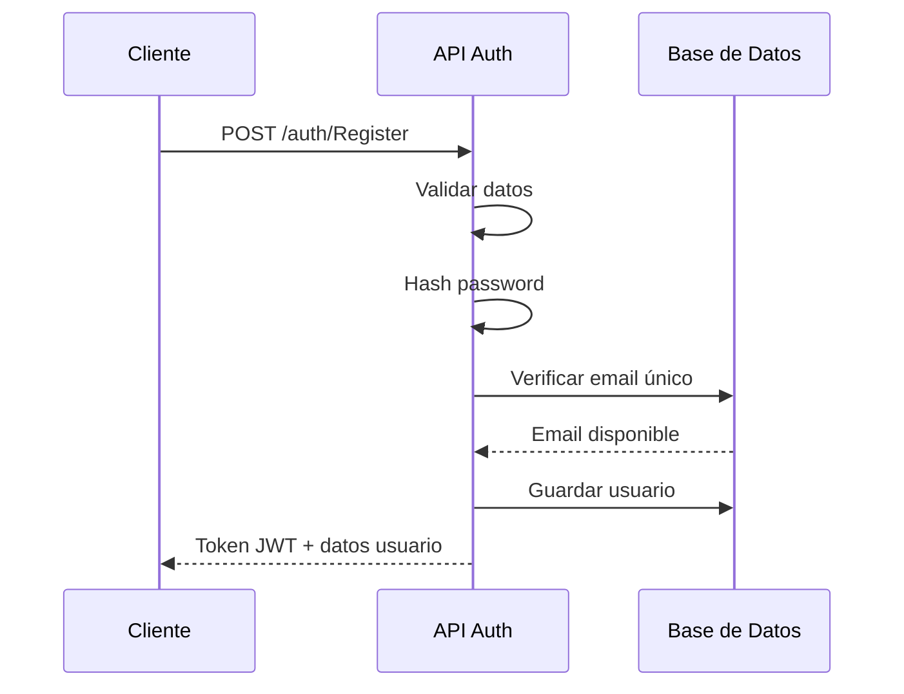
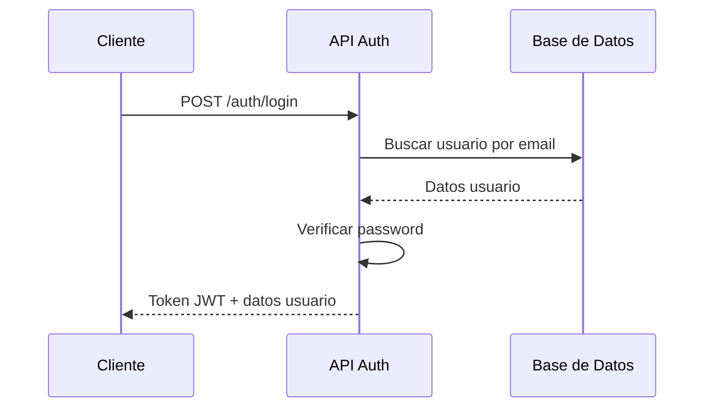
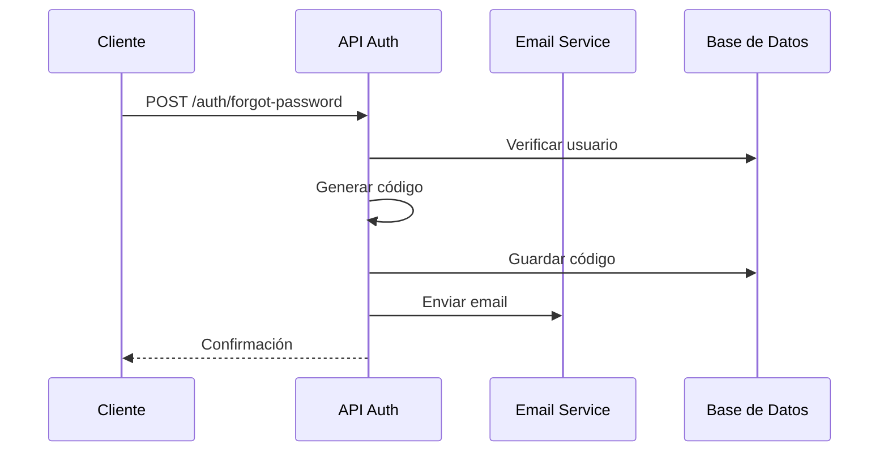

# 🔐 Autenticación y Gestión de Usuarios

## 📋 Índice
- [Información General](#información-general)
- [Modelos de Datos](#modelos-de-datos)
- [Endpoints](#endpoints)
- [Flujo de Autenticación](#flujo-de-autenticación)
- [Ejemplos de Uso](#ejemplos-de-uso)
- [Manejo de Errores](#manejo-de-errores)
- [Seguridad](#seguridad)

---

## 📖 Información General

El sistema de autenticación de APP_Mussikon_Express utiliza **JWT (JSON Web Tokens)** para manejar las sesiones de usuario. Incluye funcionalidades completas de registro, login, recuperación de contraseñas y gestión de perfiles.

### Características Principales
- ✅ Registro de usuarios con validación de datos
- ✅ Login seguro con JWT
- ✅ Recuperación de contraseñas por email
- ✅ Validación de códigos de verificación
- ✅ Gestión de perfiles de usuario
- ✅ Middleware de autenticación
- ✅ Rate limiting para endpoints sensibles

---

## 📊 Modelos de Datos

### 1. Estructura de Usuario (authUserRegister)

```typescript
interface authUserRegister {
  id?: number;
  name: string;           // Nombre del usuario
  roll: string;           // Rol: 'user', 'musician', 'admin', 'super_admin'
  lastName: string;       // Apellido del usuario
  userEmail: string;      // Email (se convierte a minúsculas)
  userPassword: string;   // Contraseña hasheada con bcrypt
  create_at: string;      // Fecha de creación
  update_at: string;      // Fecha de última actualización
  delete_at: string;      // Fecha de eliminación (soft delete)
  status: boolean;        // Estado activo/inactivo
}
```

### 2. Estructura de Usuario (User)

```typescript
interface User {
  name: string;
  lastName: string;
  userEmail: string;
  userPassword: string;
  roll: string;
  create_at?: string;
  update_at?: string;
  delete_at?: string;
  status?: boolean;
}
```

### 3. Actualización de Usuario (UpdateUser)

```typescript
interface UpdateUser {
  name?: string;
  lastName?: string;
  userEmail?: string;
  userPassword?: string;
  phone: PhoneIdentifier;  // Identificador de teléfono
  roll?: string;
  create_at?: string;
  update_at?: string;
  delete_at?: string;
  status?: boolean;
}
```

### 4. Respuesta de Login

```typescript
interface LoginResponse {
  msg: string;           // Mensaje de respuesta
  token: string;         // JWT token
  user: User;           // Datos del usuario
}
```

---

## 🚀 Endpoints

### 1. Registro de Usuario

**POST** `/auth/Register`

Registra un nuevo usuario en el sistema.

#### Headers
```
Content-Type: application/json
```

#### Body
```json
{
  "name": "Juan",
  "lastName": "Pérez",
  "roll": "user",
  "userEmail": "juan.perez@email.com",
  "userPassword": "MiContraseña*123",
  "status": true
}
```

#### Validaciones
- **name**: Requerido, string
- **lastName**: Requerido, string
- **roll**: Requerido, debe ser 'user', 'musician', 'admin', o 'super_admin'
- **userEmail**: Requerido, formato de email válido
- **userPassword**: Requerido, mínimo 6 caracteres, debe contener mayúsculas, minúsculas, números y caracteres especiales
- **status**: Opcional, boolean, por defecto true

#### Respuesta Exitosa (200)
```json
{
  "msg": "Usuario Registrado con éxito.",
  "token": "eyJhbGciOiJIUzI1NiIsInR5cCI6IkpXVCJ9...",
  "user": {
    "name": "Juan",
    "lastName": "Pérez",
    "userEmail": "juan.perez@email.com",
    "roll": "user",
    "create_at": "Mon Jan 08 2024 12:00:00 GMT+0000",
    "status": true
  }
}
```

#### Respuesta de Error (400)
```json
{
  "msg": "La contraseña no cumple con los requisitos, debe de contener Mayúsculas, Minúsculas, Números y Carácteres especiales"
}
```

#### Respuesta de Error (409)
```json
{
  "msg": "Ya hay un usuario con esta direccion de correo electrónico."
}
```

---

### 2. Login de Usuario

**POST** `/auth/login`

Autentica un usuario y devuelve un token JWT.

#### Headers
```
Content-Type: application/json
```

#### Body
```json
{
  "userEmail": "juan.perez@email.com",
  "userPassword": "MiContraseña*123"
}
```

#### Validaciones
- **userEmail**: Requerido, formato de email válido
- **userPassword**: Requerido, string

#### Respuesta Exitosa (200)
```json
{
  "msg": "Login exitoso",
  "token": "eyJhbGciOiJIUzI1NiIsInR5cCI6IkpXVCJ9...",
  "user": {
    "name": "Juan",
    "lastName": "Pérez",
    "userEmail": "juan.perez@email.com",
    "roll": "user",
    "create_at": "Mon Jan 08 2024 12:00:00 GMT+0000",
    "status": true
  }
}
```

#### Respuesta de Error (401)
```json
{
  "msg": "Credenciales incorrectas"
}
```

---

### 3. Actualización de Usuario

**PUT** `/auth/update/:userEmail`

Actualiza los datos de un usuario existente.

#### Headers
```
Content-Type: application/json
Authorization: Bearer <token-jwt>
```

#### Parámetros de URL
- **userEmail**: Email del usuario a actualizar

#### Body
```json
{
  "name": "Juan Carlos",
  "lastName": "Pérez García",
  "phone": "+1234567890"
}
```

#### Respuesta Exitosa (200)
```json
{
  "msg": "Usuario actualizado exitosamente",
  "user": {
    "name": "Juan Carlos",
    "lastName": "Pérez García",
    "userEmail": "juan.perez@email.com",
    "phone": "+1234567890",
    "update_at": "Mon Jan 08 2024 12:30:00 GMT+0000"
  }
}
```

---

### 4. Recuperación de Contraseña

**POST** `/auth/forgot-password`

Envía un código de verificación al email del usuario para recuperar su contraseña.

#### Headers
```
Content-Type: application/json
```

#### Body
```json
{
  "userEmail": "juan.perez@email.com"
}
```

#### Respuesta Exitosa (200)
```json
{
  "msg": "Código de verificación enviado al email",
  "email": "juan.perez@email.com"
}
```

#### Respuesta de Error (404)
```json
{
  "msg": "Usuario no encontrado"
}
```

---

### 5. Verificación de Código

**POST** `/auth/verify-code`

Verifica el código de recuperación enviado por email.

#### Headers
```
Content-Type: application/json
```

#### Body
```json
{
  "userEmail": "juan.perez@email.com",
  "code": "123456"
}
```

#### Respuesta Exitosa (200)
```json
{
  "msg": "Código verificado correctamente",
  "verified": true
}
```

#### Respuesta de Error (400)
```json
{
  "msg": "Código inválido o expirado"
}
```

---

### 6. Reset de Contraseña

**POST** `/auth/reset-password`

Establece una nueva contraseña después de verificar el código.

#### Headers
```
Content-Type: application/json
```

#### Body
```json
{
  "userEmail": "juan.perez@email.com",
  "code": "123456",
  "newPassword": "NuevaContraseña*456"
}
```

#### Respuesta Exitosa (200)
```json
{
  "msg": "Contraseña actualizada exitosamente"
}
```

---

### 7. Obtener Usuario por Email

**GET** `/auth/user/:userEmail`

Obtiene los datos de un usuario por su email.

#### Headers
```
Authorization: Bearer <token-jwt>
```

#### Parámetros de URL
- **userEmail**: Email del usuario

#### Respuesta Exitosa (200)
```json
{
  "user": {
    "name": "Juan",
    "lastName": "Pérez",
    "userEmail": "juan.perez@email.com",
    "roll": "user",
    "create_at": "Mon Jan 08 2024 12:00:00 GMT+0000",
    "status": true
  }
}
```

---

### 8. Eliminar Usuario

**DELETE** `/auth/user/:userEmail`

Elimina un usuario del sistema (soft delete).

#### Headers
```
Authorization: Bearer <token-jwt>
```

#### Parámetros de URL
- **userEmail**: Email del usuario a eliminar

#### Respuesta Exitosa (200)
```json
{
  "msg": "Usuario eliminado exitosamente"
}
```

---

## 🔄 Flujo de Autenticación

### 1. Registro de Usuario


### 2. Login de Usuario


### 3. Recuperación de Contraseña


---

## 💡 Ejemplos de Uso

### Ejemplo 1: Registro Completo

```javascript
// Registro de un nuevo usuario
const registerUser = async () => {
  try {
    const response = await fetch('/auth/Register', {
      method: 'POST',
      headers: {
        'Content-Type': 'application/json'
      },
      body: JSON.stringify({
        name: 'María',
        lastName: 'González',
        roll: 'musician',
        userEmail: 'maria.gonzalez@email.com',
        userPassword: 'MiContraseña*123',
        status: true
      })
    });

    const data = await response.json();
    
    if (response.ok) {
      // Guardar token en localStorage
      localStorage.setItem('token', data.token);
      localStorage.setItem('user', JSON.stringify(data.user));
      console.log('Usuario registrado:', data.user);
    } else {
      console.error('Error:', data.msg);
    }
  } catch (error) {
    console.error('Error de red:', error);
  }
};
```

### Ejemplo 2: Login y Manejo de Token

```javascript
// Login de usuario
const loginUser = async (email, password) => {
  try {
    const response = await fetch('/auth/login', {
      method: 'POST',
      headers: {
        'Content-Type': 'application/json'
      },
      body: JSON.stringify({
        userEmail: email,
        userPassword: password
      })
    });

    const data = await response.json();
    
    if (response.ok) {
      // Configurar token para futuras requests
      localStorage.setItem('token', data.token);
      localStorage.setItem('user', JSON.stringify(data.user));
      
      // Configurar interceptor de Axios
      axios.defaults.headers.common['Authorization'] = `Bearer ${data.token}`;
      
      return data.user;
    } else {
      throw new Error(data.msg);
    }
  } catch (error) {
    console.error('Error de login:', error);
    throw error;
  }
};
```

### Ejemplo 3: Request Autenticado

```javascript
// Función para hacer requests autenticados
const authenticatedRequest = async (url, options = {}) => {
  const token = localStorage.getItem('token');
  
  if (!token) {
    throw new Error('No hay token de autenticación');
  }

  const response = await fetch(url, {
    ...options,
    headers: {
      'Content-Type': 'application/json',
      'Authorization': `Bearer ${token}`,
      ...options.headers
    }
  });

  if (response.status === 401) {
    // Token expirado, redirigir al login
    localStorage.removeItem('token');
    localStorage.removeItem('user');
    window.location.href = '/login';
    return;
  }

  return response;
};

// Uso
const updateProfile = async (userData) => {
  const response = await authenticatedRequest('/auth/update/juan.perez@email.com', {
    method: 'PUT',
    body: JSON.stringify(userData)
  });
  
  return response.json();
};
```

### Ejemplo 4: Recuperación de Contraseña

```javascript
// Proceso completo de recuperación de contraseña
const forgotPasswordFlow = async (email) => {
  try {
    // Paso 1: Solicitar código
    const requestResponse = await fetch('/auth/forgot-password', {
      method: 'POST',
      headers: {
        'Content-Type': 'application/json'
      },
      body: JSON.stringify({ userEmail: email })
    });

    if (!requestResponse.ok) {
      throw new Error('Error al solicitar código');
    }

    // Paso 2: Usuario ingresa código (simulado)
    const code = prompt('Ingresa el código enviado a tu email:');
    
    // Paso 3: Verificar código
    const verifyResponse = await fetch('/auth/verify-code', {
      method: 'POST',
      headers: {
        'Content-Type': 'application/json'
      },
      body: JSON.stringify({
        userEmail: email,
        code: code
      })
    });

    if (!verifyResponse.ok) {
      throw new Error('Código inválido');
    }

    // Paso 4: Establecer nueva contraseña
    const newPassword = prompt('Ingresa tu nueva contraseña:');
    
    const resetResponse = await fetch('/auth/reset-password', {
      method: 'POST',
      headers: {
        'Content-Type': 'application/json'
      },
      body: JSON.stringify({
        userEmail: email,
        code: code,
        newPassword: newPassword
      })
    });

    if (resetResponse.ok) {
      alert('Contraseña actualizada exitosamente');
    } else {
      throw new Error('Error al actualizar contraseña');
    }

  } catch (error) {
    console.error('Error en recuperación:', error);
    alert(error.message);
  }
};
```

---

## ⚠️ Manejo de Errores

### Códigos de Error Comunes

| Código | Descripción | Solución |
|--------|-------------|----------|
| 400 | Datos de entrada inválidos | Verificar formato de email y contraseña |
| 401 | No autorizado | Verificar token JWT |
| 409 | Usuario ya existe | Usar email diferente |
| 404 | Usuario no encontrado | Verificar email |
| 500 | Error interno del servidor | Contactar soporte |

### Ejemplo de Manejo de Errores

```javascript
const handleAuthError = (error, response) => {
  switch (response.status) {
    case 400:
      if (error.msg.includes('contraseña')) {
        alert('La contraseña debe contener mayúsculas, minúsculas, números y caracteres especiales');
      } else if (error.msg.includes('email')) {
        alert('Formato de email inválido');
      }
      break;
      
    case 401:
      alert('Credenciales incorrectas');
      break;
      
    case 409:
      alert('Ya existe un usuario con este email');
      break;
      
    case 404:
      alert('Usuario no encontrado');
      break;
      
    default:
      alert('Error inesperado. Intenta nuevamente.');
  }
};
```

---

## 🔒 Seguridad

### Validaciones de Contraseña
- Mínimo 6 caracteres
- Al menos una mayúscula
- Al menos una minúscula
- Al menos un número
- Al menos un carácter especial

### Validaciones de Email
- Formato de email válido
- Conversión automática a minúsculas
- Verificación de unicidad

### JWT Token
- Expiración configurable
- Firma segura
- Refresh token opcional

### Rate Limiting
- 10 requests por minuto para endpoints de autenticación
- Bloqueo temporal en caso de exceso

### Middleware de Seguridad
```javascript
// Ejemplo de middleware de autenticación
const authMiddleware = (req, res, next) => {
  const token = req.headers.authorization?.split(' ')[1];
  
  if (!token) {
    return res.status(401).json({ msg: 'Token requerido' });
  }
  
  try {
    const decoded = jwt.verify(token, process.env.JWT_SECRET);
    req.user = decoded;
    next();
  } catch (error) {
    return res.status(401).json({ msg: 'Token inválido' });
  }
};
```

---

## 📝 Notas Importantes

1. **Tokens JWT**: Los tokens tienen una duración limitada. Implementa renovación automática.
2. **Contraseñas**: Siempre se hashean con bcrypt antes de almacenar.
3. **Emails**: Se convierten automáticamente a minúsculas.
4. **Soft Delete**: Los usuarios no se eliminan físicamente, se marcan como inactivos.
5. **Validaciones**: Todos los datos se validan tanto en frontend como backend.

---

*Última actualización: Enero 2025* 