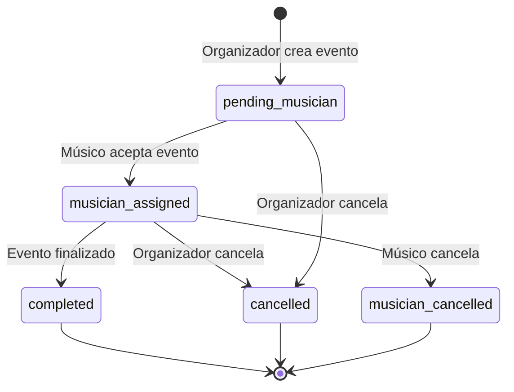
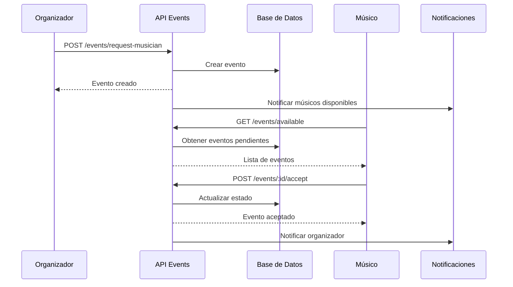
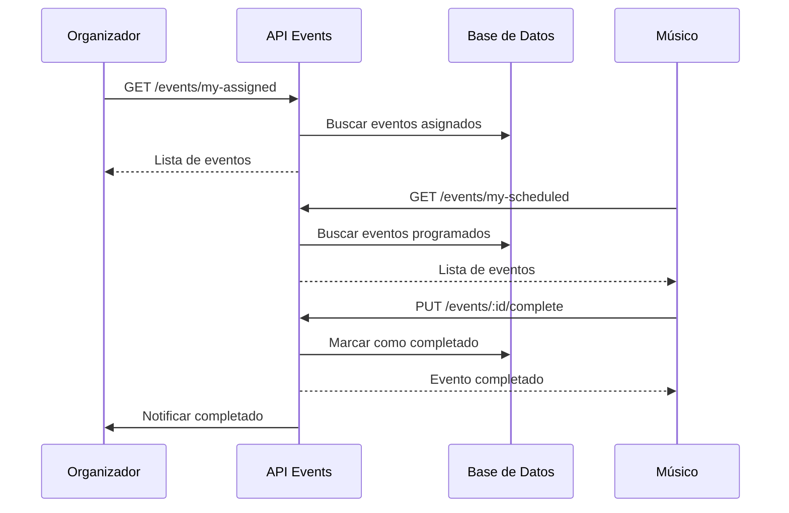

# 🎪 Sistema de Eventos y Matching

## 📋 Índice
- [Información General](#información-general)
- [Modelos de Datos](#modelos-de-datos)
- [Estados de Eventos](#estados-de-eventos)
- [Endpoints](#endpoints)
- [Flujos de Trabajo](#flujos-de-trabajo)
- [Ejemplos de Uso](#ejemplos-de-uso)
- [Manejo de Errores](#manejo-de-errores)
- [Notificaciones en Tiempo Real](#notificaciones-en-tiempo-real)

---

## 📖 Información General

El sistema de eventos de APP_Mussikon_Express permite a los organizadores crear solicitudes de músicos y a los músicos aceptar y gestionar eventos. El sistema incluye un flujo completo desde la creación hasta la finalización del evento.

### Características Principales
- ✅ Creación de solicitudes de músicos por organizadores
- ✅ Sistema de matching entre organizadores y músicos
- ✅ Gestión de estados de eventos (pendiente, asignado, completado, cancelado)
- ✅ Búsqueda y filtrado de eventos disponibles
- ✅ Notificaciones en tiempo real
- ✅ Historial completo de eventos
- ✅ Validación de permisos por rol

### Roles en el Sistema
- **Organizador (eventCreator)**: Crea solicitudes de músicos
- **Músico (musico)**: Acepta y gestiona eventos
- **Admin**: Puede ver y gestionar todos los eventos

---

## 📊 Modelos de Datos

### 1. Estructura de Evento (Event)

```typescript
interface Event {
  id: string;                    // ID único de Firestore
  user: string;                  // Email del organizador
  eventName: string;             // Nombre del evento
  eventType: string;             // Tipo de evento (fiesta, boda, etc.)
  date: string;                  // Fecha del evento
  time: string;                  // Hora del evento
  location: string;              // Ubicación del evento
  duration: string;              // Duración del evento
  instrument: string;            // Instrumento requerido
  bringInstrument: boolean;      // Si el músico debe llevar su instrumento
  comment: string;               // Comentarios adicionales
  budget: string;                // Presupuesto del evento
  flyerUrl?: string;             // URL del flyer del evento
  songs: string[];               // Lista de canciones solicitadas
  recommendations: string[];     // Recomendaciones del organizador
  mapsLink: string;              // Enlace a Google Maps
  status: EventStatus;           // Estado actual del evento
  assignedMusicianId?: string;   // Email del músico asignado
  interestedMusicians?: string[]; // Lista de músicos interesados
  createdAt: string;             // Fecha de creación
  updatedAt: string;             // Fecha de última actualización
}
```

### 2. Estados de Evento (EventStatus)

```typescript
type EventStatus = 
  | 'pending_musician'      // Pendiente de asignar músico
  | 'musician_assigned'     // Músico asignado
  | 'completed'             // Evento completado
  | 'cancelled'             // Evento cancelado
  | 'musician_cancelled';   // Cancelado por el músico
```

### 3. Creación de Evento

```typescript
interface CreateEventRequest {
  eventName: string;
  eventType: string;
  date: string;
  time: string;
  location: string;
  duration: string;
  instrument: string;
  bringInstrument: boolean;
  comment: string;
  budget: string;
  flyerUrl?: string;
  songs: string[];
  recommendations: string[];
  mapsLink: string;
}
```

---

## 🔄 Estados de Eventos

### Flujo de Estados



### Descripción de Estados

| Estado | Descripción | Quién puede cambiar |
|--------|-------------|-------------------|
| `pending_musician` | Evento creado, esperando músico | Organizador, Músico |
| `musician_assigned` | Músico asignado al evento | Organizador, Músico |
| `completed` | Evento finalizado exitosamente | Organizador, Músico |
| `cancelled` | Evento cancelado por organizador | Solo Organizador |
| `musician_cancelled` | Evento cancelado por músico | Solo Músico |

---

## 🚀 Endpoints

### 1. Crear Solicitud de Músico

**POST** `/events/request-musician`

Crea una nueva solicitud de músico (solo organizadores).

#### Headers
```
Content-Type: application/json
Authorization: Bearer <token-jwt>
```

#### Body
```json
{
  "eventName": "Boda de Juan y María",
  "eventType": "boda",
  "date": "2024-06-15",
  "time": "18:00",
  "location": "Salón Los Pinos",
  "duration": "3 horas",
  "instrument": "guitarra",
  "bringInstrument": true,
  "comment": "Necesitamos música romántica para la ceremonia",
  "budget": "50000",
  "flyerUrl": "https://example.com/flyer.jpg",
  "songs": [
    "Perfect - Ed Sheeran",
    "All of Me - John Legend"
  ],
  "recommendations": [
    "Música romántica",
    "Canciones en español"
  ],
  "mapsLink": "https://maps.google.com/?q=SalonLosPinos"
}
```

#### Validaciones
- **eventName**: Requerido, string
- **eventType**: Requerido, string
- **date**: Requerido, formato YYYY-MM-DD
- **time**: Requerido, formato HH:MM
- **location**: Requerido, string
- **duration**: Requerido, string
- **instrument**: Requerido, string
- **bringInstrument**: Requerido, boolean
- **comment**: Requerido, string
- **budget**: Requerido, string
- **flyerUrl**: Opcional, URL válida
- **songs**: Array de strings
- **recommendations**: Array de strings
- **mapsLink**: Requerido, URL válida

#### Respuesta Exitosa (201)
```json
{
  "data": {
    "id": "event_123456",
    "user": "organizador@email.com",
    "eventName": "Boda de Juan y María",
    "eventType": "boda",
    "date": "2024-06-15",
    "time": "18:00",
    "location": "Salón Los Pinos",
    "duration": "3 horas",
    "instrument": "guitarra",
    "bringInstrument": true,
    "comment": "Necesitamos música romántica para la ceremonia",
    "budget": "50000",
    "flyerUrl": "https://example.com/flyer.jpg",
    "songs": ["Perfect - Ed Sheeran", "All of Me - John Legend"],
    "recommendations": ["Música romántica", "Canciones en español"],
    "mapsLink": "https://maps.google.com/?q=SalonLosPinos",
    "status": "pending_musician",
    "interestedMusicians": [],
    "createdAt": "2024-01-08T12:00:00.000Z",
    "updatedAt": "2024-01-08T12:00:00.000Z"
  }
}
```

#### Respuesta de Error (403)
```json
{
  "msg": "Solo los organizadores pueden crear solicitudes"
}
```

---

### 2. Mis Eventos Pendientes

**GET** `/events/my-pending`

Obtiene los eventos pendientes del organizador autenticado.

#### Headers
```
Authorization: Bearer <token-jwt>
```

#### Respuesta Exitosa (200)
```json
{
  "data": [
    {
      "id": "event_123456",
      "user": "organizador@email.com",
      "eventName": "Boda de Juan y María",
      "status": "pending_musician",
      "date": "2024-06-15",
      "location": "Salón Los Pinos",
      "instrument": "guitarra",
      "budget": "50000",
      "createdAt": "2024-01-08T12:00:00.000Z"
    }
  ]
}
```

---

### 3. Mis Eventos Asignados

**GET** `/events/my-assigned`

Obtiene los eventos asignados del organizador autenticado.

#### Headers
```
Authorization: Bearer <token-jwt>
```

#### Respuesta Exitosa (200)
```json
{
  "data": [
    {
      "id": "event_123456",
      "user": "organizador@email.com",
      "eventName": "Boda de Juan y María",
      "status": "musician_assigned",
      "assignedMusicianId": "musico@email.com",
      "date": "2024-06-15",
      "location": "Salón Los Pinos",
      "instrument": "guitarra",
      "budget": "50000",
      "createdAt": "2024-01-08T12:00:00.000Z"
    }
  ]
}
```

---

### 4. Mis Eventos Completados

**GET** `/events/my-completed`

Obtiene los eventos completados del organizador autenticado.

#### Headers
```
Authorization: Bearer <token-jwt>
```

#### Respuesta Exitosa (200)
```json
{
  "data": [
    {
      "id": "event_123456",
      "user": "organizador@email.com",
      "eventName": "Boda de Juan y María",
      "status": "completed",
      "assignedMusicianId": "musico@email.com",
      "date": "2024-06-15",
      "location": "Salón Los Pinos",
      "instrument": "guitarra",
      "budget": "50000",
      "createdAt": "2024-01-08T12:00:00.000Z"
    }
  ]
}
```

---

### 5. Eventos Disponibles (Músicos)

**GET** `/events/available`

Obtiene todos los eventos disponibles para músicos.

#### Headers
```
Authorization: Bearer <token-jwt>
```

#### Respuesta Exitosa (200)
```json
{
  "data": [
    {
      "id": "event_123456",
      "user": "organizador@email.com",
      "eventName": "Boda de Juan y María",
      "eventType": "boda",
      "date": "2024-06-15",
      "time": "18:00",
      "location": "Salón Los Pinos",
      "duration": "3 horas",
      "instrument": "guitarra",
      "bringInstrument": true,
      "comment": "Necesitamos música romántica para la ceremonia",
      "budget": "50000",
      "status": "pending_musician",
      "createdAt": "2024-01-08T12:00:00.000Z"
    }
  ]
}
```

---

### 6. Aceptar Evento (Músicos)

**POST** `/events/:eventId/accept`

Un músico acepta un evento disponible.

#### Headers
```
Authorization: Bearer <token-jwt>
```

#### Parámetros de URL
- **eventId**: ID del evento a aceptar

#### Respuesta Exitosa (200)
```json
{
  "id": "event_123456",
  "user": "organizador@email.com",
  "eventName": "Boda de Juan y María",
  "status": "musician_assigned",
  "assignedMusicianId": "musico@email.com",
  "updatedAt": "2024-01-08T12:30:00.000Z"
}
```

#### Respuesta de Error (403)
```json
{
  "msg": "Solo los músicos pueden aceptar eventos."
}
```

#### Respuesta de Error (400)
```json
{
  "msg": "No se pudo aceptar el evento."
}
```

---

### 7. Mis Eventos Programados (Músicos)

**GET** `/events/my-scheduled`

Obtiene los eventos programados del músico autenticado.

#### Headers
```
Authorization: Bearer <token-jwt>
```

#### Respuesta Exitosa (200)
```json
{
  "data": [
    {
      "id": "event_123456",
      "user": "organizador@email.com",
      "eventName": "Boda de Juan y María",
      "status": "musician_assigned",
      "date": "2024-06-15",
      "time": "18:00",
      "location": "Salón Los Pinos",
      "instrument": "guitarra",
      "budget": "50000",
      "createdAt": "2024-01-08T12:00:00.000Z"
    }
  ]
}
```

---

### 8. Mis Presentaciones Pasadas (Músicos)

**GET** `/events/my-past-performances`

Obtiene el historial de eventos completados del músico autenticado.

#### Headers
```
Authorization: Bearer <token-jwt>
```

#### Respuesta Exitosa (200)
```json
{
  "data": [
    {
      "id": "event_123456",
      "user": "organizador@email.com",
      "eventName": "Boda de Juan y María",
      "status": "completed",
      "date": "2024-06-15",
      "location": "Salón Los Pinos",
      "instrument": "guitarra",
      "budget": "50000",
      "createdAt": "2024-01-08T12:00:00.000Z"
    }
  ]
}
```

---

### 9. Obtener Evento por ID

**GET** `/events/:eventId`

Obtiene los detalles completos de un evento específico.

#### Headers
```
Authorization: Bearer <token-jwt>
```

#### Parámetros de URL
- **eventId**: ID del evento

#### Respuesta Exitosa (200)
```json
{
  "data": {
    "id": "event_123456",
    "user": "organizador@email.com",
    "eventName": "Boda de Juan y María",
    "eventType": "boda",
    "date": "2024-06-15",
    "time": "18:00",
    "location": "Salón Los Pinos",
    "duration": "3 horas",
    "instrument": "guitarra",
    "bringInstrument": true,
    "comment": "Necesitamos música romántica para la ceremonia",
    "budget": "50000",
    "flyerUrl": "https://example.com/flyer.jpg",
    "songs": ["Perfect - Ed Sheeran", "All of Me - John Legend"],
    "recommendations": ["Música romántica", "Canciones en español"],
    "mapsLink": "https://maps.google.com/?q=SalonLosPinos",
    "status": "musician_assigned",
    "assignedMusicianId": "musico@email.com",
    "interestedMusicians": [],
    "createdAt": "2024-01-08T12:00:00.000Z",
    "updatedAt": "2024-01-08T12:30:00.000Z"
  }
}
```

#### Respuesta de Error (404)
```json
{
  "msg": "Evento no encontrado"
}
```

---

### 10. Cancelar Evento

**PUT** `/events/:eventId/cancel`

Cancela un evento (solo organizador o músico asignado).

#### Headers
```
Authorization: Bearer <token-jwt>
```

#### Parámetros de URL
- **eventId**: ID del evento a cancelar

#### Body
```json
{
  "reason": "Cambio de fecha del evento"
}
```

#### Respuesta Exitosa (200)
```json
{
  "id": "event_123456",
  "status": "cancelled",
  "updatedAt": "2024-01-08T13:00:00.000Z",
  "msg": "Evento cancelado exitosamente"
}
```

---

### 11. Completar Evento

**PUT** `/events/:eventId/complete`

Marca un evento como completado.

#### Headers
```
Authorization: Bearer <token-jwt>
```

#### Parámetros de URL
- **eventId**: ID del evento a completar

#### Respuesta Exitosa (200)
```json
{
  "id": "event_123456",
  "status": "completed",
  "updatedAt": "2024-01-08T14:00:00.000Z",
  "msg": "Evento completado exitosamente"
}
```

---

### 12. Eliminar Evento

**DELETE** `/events/:eventId`

Elimina completamente un evento (solo organizador).

#### Headers
```
Authorization: Bearer <token-jwt>
```

#### Parámetros de URL
- **eventId**: ID del evento a eliminar

#### Respuesta Exitosa (200)
```json
{
  "success": true,
  "eventId": "event_123456",
  "msg": "Evento eliminado exitosamente"
}
```

#### Respuesta de Error (403)
```json
{
  "msg": "Solo el organizador puede eliminar este evento"
}
```

---

## 🔄 Flujos de Trabajo

### 1. Flujo de Creación y Asignación



### 2. Flujo de Gestión de Eventos



---

## 💡 Ejemplos de Uso

### Ejemplo 1: Crear Solicitud de Músico

```javascript
// Crear una nueva solicitud de músico
const createEventRequest = async (eventData) => {
  try {
    const response = await fetch('/events/request-musician', {
      method: 'POST',
      headers: {
        'Content-Type': 'application/json',
        'Authorization': `Bearer ${localStorage.getItem('token')}`
      },
      body: JSON.stringify({
        eventName: 'Boda de Juan y María',
        eventType: 'boda',
        date: '2024-06-15',
        time: '18:00',
        location: 'Salón Los Pinos',
        duration: '3 horas',
        instrument: 'guitarra',
        bringInstrument: true,
        comment: 'Necesitamos música romántica para la ceremonia',
        budget: '50000',
        flyerUrl: 'https://example.com/flyer.jpg',
        songs: ['Perfect - Ed Sheeran', 'All of Me - John Legend'],
        recommendations: ['Música romántica', 'Canciones en español'],
        mapsLink: 'https://maps.google.com/?q=SalonLosPinos'
      })
    });

    const data = await response.json();
    
    if (response.ok) {
      console.log('Evento creado:', data.data);
      return data.data;
    } else {
      throw new Error(data.msg);
    }
  } catch (error) {
    console.error('Error al crear evento:', error);
    throw error;
  }
};
```

### Ejemplo 2: Obtener Eventos Disponibles (Músico)

```javascript
// Obtener eventos disponibles para músicos
const getAvailableEvents = async () => {
  try {
    const response = await fetch('/events/available', {
      method: 'GET',
      headers: {
        'Authorization': `Bearer ${localStorage.getItem('token')}`
      }
    });

    const data = await response.json();
    
    if (response.ok) {
      console.log('Eventos disponibles:', data.data);
      return data.data;
    } else {
      throw new Error(data.msg);
    }
  } catch (error) {
    console.error('Error al obtener eventos:', error);
    throw error;
  }
};
```

### Ejemplo 3: Aceptar Evento (Músico)

```javascript
// Un músico acepta un evento
const acceptEvent = async (eventId) => {
  try {
    const response = await fetch(`/events/${eventId}/accept`, {
      method: 'POST',
      headers: {
        'Authorization': `Bearer ${localStorage.getItem('token')}`
      }
    });

    const data = await response.json();
    
    if (response.ok) {
      console.log('Evento aceptado:', data);
      return data;
    } else {
      throw new Error(data.msg);
    }
  } catch (error) {
    console.error('Error al aceptar evento:', error);
    throw error;
  }
};
```

### Ejemplo 4: Gestión Completa de Eventos

```javascript
// Clase para gestionar eventos
class EventManager {
  constructor() {
    this.baseUrl = '/events';
    this.token = localStorage.getItem('token');
  }

  // Obtener eventos por estado
  async getEventsByStatus(status) {
    const endpoints = {
      'pending': '/my-pending',
      'assigned': '/my-assigned',
      'completed': '/my-completed',
      'scheduled': '/my-scheduled',
      'past': '/my-past-performances'
    };

    const response = await fetch(`${this.baseUrl}${endpoints[status]}`, {
      headers: {
        'Authorization': `Bearer ${this.token}`
      }
    });

    const data = await response.json();
    return data.data;
  }

  // Obtener detalles de un evento
  async getEventDetails(eventId) {
    const response = await fetch(`${this.baseUrl}/${eventId}`, {
      headers: {
        'Authorization': `Bearer ${this.token}`
      }
    });

    const data = await response.json();
    return data.data;
  }

  // Cancelar evento
  async cancelEvent(eventId, reason) {
    const response = await fetch(`${this.baseUrl}/${eventId}/cancel`, {
      method: 'PUT',
      headers: {
        'Content-Type': 'application/json',
        'Authorization': `Bearer ${this.token}`
      },
      body: JSON.stringify({ reason })
    });

    const data = await response.json();
    return data;
  }

  // Completar evento
  async completeEvent(eventId) {
    const response = await fetch(`${this.baseUrl}/${eventId}/complete`, {
      method: 'PUT',
      headers: {
        'Authorization': `Bearer ${this.token}`
      }
    });

    const data = await response.json();
    return data;
  }
}

// Uso
const eventManager = new EventManager();

// Obtener eventos pendientes
const pendingEvents = await eventManager.getEventsByStatus('pending');

// Obtener detalles de un evento
const eventDetails = await eventManager.getEventDetails('event_123456');

// Cancelar un evento
await eventManager.cancelEvent('event_123456', 'Cambio de fecha');
```

### Ejemplo 5: Dashboard de Eventos

```javascript
// Dashboard completo para organizadores
const createEventDashboard = async () => {
  try {
    const [pending, assigned, completed] = await Promise.all([
      fetch('/events/my-pending', {
        headers: { 'Authorization': `Bearer ${localStorage.getItem('token')}` }
      }).then(r => r.json()),
      fetch('/events/my-assigned', {
        headers: { 'Authorization': `Bearer ${localStorage.getItem('token')}` }
      }).then(r => r.json()),
      fetch('/events/my-completed', {
        headers: { 'Authorization': `Bearer ${localStorage.getItem('token')}` }
      }).then(r => r.json())
    ]);

    return {
      pending: pending.data || [],
      assigned: assigned.data || [],
      completed: completed.data || [],
      stats: {
        total: (pending.data?.length || 0) + (assigned.data?.length || 0) + (completed.data?.length || 0),
        pending: pending.data?.length || 0,
        assigned: assigned.data?.length || 0,
        completed: completed.data?.length || 0
      }
    };
  } catch (error) {
    console.error('Error al cargar dashboard:', error);
    throw error;
  }
};

// Dashboard para músicos
const createMusicianDashboard = async () => {
  try {
    const [available, scheduled, past] = await Promise.all([
      fetch('/events/available', {
        headers: { 'Authorization': `Bearer ${localStorage.getItem('token')}` }
      }).then(r => r.json()),
      fetch('/events/my-scheduled', {
        headers: { 'Authorization': `Bearer ${localStorage.getItem('token')}` }
      }).then(r => r.json()),
      fetch('/events/my-past-performances', {
        headers: { 'Authorization': `Bearer ${localStorage.getItem('token')}` }
      }).then(r => r.json())
    ]);

    return {
      available: available.data || [],
      scheduled: scheduled.data || [],
      past: past.data || [],
      stats: {
        total: (scheduled.data?.length || 0) + (past.data?.length || 0),
        available: available.data?.length || 0,
        scheduled: scheduled.data?.length || 0,
        completed: past.data?.length || 0
      }
    };
  } catch (error) {
    console.error('Error al cargar dashboard:', error);
    throw error;
  }
};
```

---

## ⚠️ Manejo de Errores

### Códigos de Error Comunes

| Código | Descripción | Solución |
|--------|-------------|----------|
| 400 | Datos de entrada inválidos | Verificar formato de datos |
| 401 | No autorizado | Verificar token JWT |
| 403 | Prohibido | Verificar permisos de rol |
| 404 | Evento no encontrado | Verificar ID del evento |
| 409 | Evento ya asignado | Evento no disponible |
| 500 | Error interno del servidor | Contactar soporte |

### Ejemplo de Manejo de Errores

```javascript
const handleEventError = (error, response) => {
  switch (response.status) {
    case 400:
      alert('Datos de entrada inválidos. Verifica el formato.');
      break;
      
    case 401:
      alert('Sesión expirada. Inicia sesión nuevamente.');
      localStorage.removeItem('token');
      window.location.href = '/login';
      break;
      
    case 403:
      alert('No tienes permisos para realizar esta acción.');
      break;
      
    case 404:
      alert('Evento no encontrado.');
      break;
      
    case 409:
      alert('Este evento ya no está disponible.');
      break;
      
    default:
      alert('Error inesperado. Intenta nuevamente.');
  }
};
```

---

## 🔔 Notificaciones en Tiempo Real

### Eventos de Socket.IO

```javascript
// Configuración de Socket.IO para eventos
const socket = io('https://tu-backend.com');

// Escuchar nuevos eventos
socket.on('new_event_request', (event) => {
  console.log('Nuevo evento disponible:', event);
  // Actualizar lista de eventos disponibles
  updateAvailableEvents();
});

// Escuchar asignación de músico
socket.on('musician_assigned', (data) => {
  console.log('Músico asignado al evento:', data);
  // Notificar al organizador
  showNotification('Un músico ha sido asignado a tu evento');
});

// Escuchar cancelación de evento
socket.on('event_cancelled', (data) => {
  console.log('Evento cancelado:', data);
  // Actualizar estado del evento
  updateEventStatus(data.eventId, 'cancelled');
});

// Escuchar completado de evento
socket.on('event_completed', (data) => {
  console.log('Evento completado:', data);
  // Actualizar estado del evento
  updateEventStatus(data.eventId, 'completed');
});
```

### Ejemplo de Integración con Notificaciones

```javascript
// Sistema de notificaciones para eventos
class EventNotifications {
  constructor() {
    this.socket = io('https://tu-backend.com');
    this.setupListeners();
  }

  setupListeners() {
    // Nuevo evento disponible
    this.socket.on('new_event_request', (event) => {
      this.showNotification('Nuevo evento disponible', {
        title: event.eventName,
        body: `${event.eventType} - ${event.location}`,
        icon: '/icon.png',
        onClick: () => this.openEventDetails(event.id)
      });
    });

    // Músico asignado
    this.socket.on('musician_assigned', (data) => {
      this.showNotification('Músico asignado', {
        title: 'Tu evento tiene músico',
        body: `Un músico ha sido asignado a "${data.eventName}"`,
        icon: '/icon.png',
        onClick: () => this.openEventDetails(data.eventId)
      });
    });

    // Evento cancelado
    this.socket.on('event_cancelled', (data) => {
      this.showNotification('Evento cancelado', {
        title: 'Evento cancelado',
        body: `El evento "${data.eventName}" ha sido cancelado`,
        icon: '/icon.png'
      });
    });
  }

  showNotification(title, options = {}) {
    if ('Notification' in window && Notification.permission === 'granted') {
      new Notification(title, options);
    }
  }

  openEventDetails(eventId) {
    window.open(`/events/${eventId}`, '_blank');
  }
}

// Inicializar notificaciones
const eventNotifications = new EventNotifications();
```

---

## 📝 Notas Importantes

1. **Permisos**: Los endpoints verifican el rol del usuario antes de permitir acciones.
2. **Estados**: Los eventos tienen un flujo de estados específico que debe respetarse.
3. **Notificaciones**: El sistema incluye notificaciones en tiempo real para cambios de estado.
4. **Validaciones**: Todos los datos se validan tanto en frontend como backend.
5. **Soft Delete**: Los eventos cancelados se mantienen en la base de datos para auditoría.

---

*Última actualización: Enero 2025* 