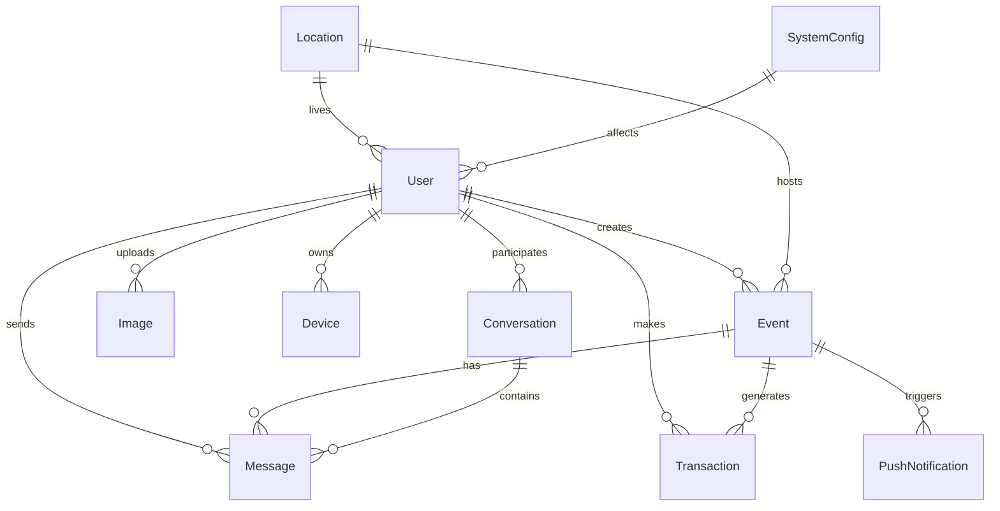

# 📊 Modelos de Datos - APP_Mussikon_Express

## 📋 Índice
- [Información General](#información-general)
- [Modelos de Autenticación](#modelos-de-autenticación)
- [Modelos de Eventos](#modelos-de-eventos)
- [Modelos de Imágenes](#modelos-de-imágenes)
- [Modelos de Chat](#modelos-de-chat)
- [Modelos de Notificaciones](#modelos-de-notificaciones)
- [Modelos de Pagos](#modelos-de-pagos)
- [Modelos de Búsqueda](#modelos-de-búsqueda)
- [Modelos de Analytics](#modelos-de-analytics)
- [Modelos de Geolocalización](#modelos-de-geolocalización)

---

## 📖 Información General

Esta documentación describe todos los modelos de datos utilizados en el backend de APP_Mussikon_Express. Cada modelo incluye su estructura TypeScript, validaciones y relaciones con otros modelos.

### Convenciones de Nomenclatura
- **Interfaces**: PascalCase (ej: `User`, `Event`)
- **Tipos**: PascalCase con sufijo `Type` (ej: `EventStatus`, `UserRole`)
- **Enums**: PascalCase (ej: `EventType`, `NotificationType`)
- **Campos**: camelCase (ej: `userEmail`, `eventName`)

### Tipos de Datos Comunes
- **ID**: `string` (Firestore document ID)
- **Email**: `string` (siempre en minúsculas)
- **Fecha**: `string` (ISO 8601 format)
- **Estado**: `boolean` o enum específico
- **URLs**: `string` (URLs válidas)

---

## 🔐 Modelos de Autenticación

### 1. Usuario de Registro (authUserRegister)

```typescript
interface authUserRegister {
  id?: number;                    // ID opcional
  name: string;                   // Nombre del usuario
  roll: string;                   // Rol: 'user', 'musician', 'admin', 'super_admin'
  lastName: string;               // Apellido del usuario
  userEmail: string;              // Email (se convierte a minúsculas)
  userPassword: string;           // Contraseña hasheada con bcrypt
  create_at: string;              // Fecha de creación
  update_at: string;              // Fecha de última actualización
  delete_at: string;              // Fecha de eliminación (soft delete)
  status: boolean;                // Estado activo/inactivo
}
```

### 2. Usuario (User)

```typescript
interface User {
  name: string;                   // Nombre del usuario
  lastName: string;               // Apellido del usuario
  userEmail: string;              // Email del usuario
  userPassword: string;           // Contraseña hasheada
  roll: string;                   // Rol del usuario
  create_at?: string;             // Fecha de creación (opcional)
  update_at?: string;             // Fecha de actualización (opcional)
  delete_at?: string;             // Fecha de eliminación (opcional)
  status?: boolean;               // Estado del usuario (opcional)
}
```

### 3. Actualización de Usuario (UpdateUser)

```typescript
interface UpdateUser {
  name?: string;                  // Nombre (opcional)
  lastName?: string;              // Apellido (opcional)
  userEmail?: string;             // Email (opcional)
  userPassword?: string;          // Contraseña (opcional)
  phone: PhoneIdentifier;         // Identificador de teléfono
  roll?: string;                  // Rol (opcional)
  create_at?: string;             // Fecha de creación (opcional)
  update_at?: string;             // Fecha de actualización (opcional)
  delete_at?: string;             // Fecha de eliminación (opcional)
  status?: boolean;               // Estado (opcional)
}
```

### 4. Respuesta de Login

```typescript
interface LoginResponse {
  msg: string;                    // Mensaje de respuesta
  token: string;                  // JWT token
  user: User;                     // Datos del usuario
}
```

### 5. Roles de Usuario

```typescript
type UserRole = 
  | 'user'           // Usuario regular
  | 'musician'       // Músico
  | 'admin'          // Administrador
  | 'super_admin';   // Super administrador
```

---

## 🎪 Modelos de Eventos

### 1. Evento (Event)

```typescript
interface Event {
  id: string;                     // ID único de Firestore
  user: string;                   // Email del organizador
  eventName: string;              // Nombre del evento
  eventType: string;              // Tipo de evento
  date: string;                   // Fecha del evento (YYYY-MM-DD)
  time: string;                   // Hora del evento (HH:MM)
  location: string;               // Ubicación del evento
  duration: string;               // Duración del evento
  instrument: string;             // Instrumento requerido
  bringInstrument: boolean;       // Si el músico debe llevar su instrumento
  comment: string;                // Comentarios adicionales
  budget: string;                 // Presupuesto del evento
  flyerUrl?: string;              // URL del flyer del evento
  songs: string[];                // Lista de canciones solicitadas
  recommendations: string[];      // Recomendaciones del organizador
  mapsLink: string;               // Enlace a Google Maps
  status: EventStatus;            // Estado actual del evento
  assignedMusicianId?: string;    // Email del músico asignado
  interestedMusicians?: string[]; // Lista de músicos interesados
  createdAt: string;              // Fecha de creación (ISO)
  updatedAt: string;              // Fecha de última actualización (ISO)
}
```

### 2. Estados de Evento (EventStatus)

```typescript
type EventStatus = 
  | 'pending_musician'      // Pendiente de asignar músico
  | 'musician_assigned'     // Músico asignado
  | 'completed'             // Evento completado
  | 'cancelled'             // Evento cancelado
  | 'musician_cancelled';   // Cancelado por el músico
```

### 3. Creación de Evento

```typescript
interface CreateEventRequest {
  eventName: string;              // Nombre del evento
  eventType: string;              // Tipo de evento
  date: string;                   // Fecha del evento
  time: string;                   // Hora del evento
  location: string;               // Ubicación del evento
  duration: string;               // Duración del evento
  instrument: string;             // Instrumento requerido
  bringInstrument: boolean;       // Si el músico debe llevar su instrumento
  comment: string;                // Comentarios adicionales
  budget: string;                 // Presupuesto del evento
  flyerUrl?: string;              // URL del flyer del evento
  songs: string[];                // Lista de canciones solicitadas
  recommendations: string[];      // Recomendaciones del organizador
  mapsLink: string;               // Enlace a Google Maps
}
```

### 4. Tipos de Evento

```typescript
type EventType = 
  | 'boda'              // Boda
  | 'fiesta'            // Fiesta
  | 'evento_corporativo' // Evento corporativo
  | 'restaurante'       // Restaurante
  | 'bar'               // Bar
  | 'club'              // Club nocturno
  | 'evento_privado'    // Evento privado
  | 'otro';             // Otro tipo
```

### 5. Datos de Evento (eventData)

```typescript
interface eventData {
  organizerId: string;            // ID del organizador
  title: string;                  // Título del evento
  description: string;            // Descripción del evento
  location: string;               // Ubicación del evento
  startTime: Date;                // Hora de inicio
  endTime: Date;                  // Hora de fin
  musicianPreferences: string[];  // Preferencias de músico
  budget: number;                 // Presupuesto
}
```

### 6. Alerta de Evento (EventAlert)

```typescript
type EventAlert = {
  id: string;                     // ID único de la alerta
  eventId: string;                // ID del evento relacionado
  title: string;                  // Título del evento
  description?: string;           // Descripción opcional
  location: string;               // Lugar del evento
  startDateTime: string;          // Fecha/hora inicio (ISO string)
  endDateTime: string;            // Fecha/hora fin (ISO string)
  organizerId: string;            // UID del organizador
  musicianId: string;             // UID del músico que recibe la alerta
  createdAt: string;              // Fecha de creación de la alerta
  status: "pending" | "accepted" | "declined"; // Estado
  calendarEventId?: string;       // ID del evento en Google Calendar (si se agregó)
};
```

---

## 🖼️ Modelos de Imágenes

### 1. Imagen (Image)

```typescript
interface Image {
  id: string;                     // ID único de la imagen
  url: string;                    // URL firmada de la imagen
  originalName: string;           // Nombre original del archivo
  fileName: string;               // Nombre del archivo en storage
  size: number;                   // Tamaño en bytes
  mimetype: string;               // Tipo MIME del archivo
  category: ImageCategory;        // Categoría de la imagen
  userId: string;                 // ID del propietario de la imagen
  description?: string;           // Descripción opcional
  tags?: string[];                // Etiquetas de la imagen
  metadata?: Record<string, any>; // Metadatos adicionales
  isPublic: boolean;              // Si la imagen es pública
  isActive: boolean;              // Si la imagen está activa
  createdAt: string;              // Fecha de creación
  updatedAt: string;              // Fecha de última actualización
  expiresAt?: string;             // Fecha de expiración (para URLs temporales)
}
```

### 2. Categorías de Imagen (ImageCategory)

```typescript
type ImageCategory = 
  | 'profile'     // Imagen de perfil
  | 'post'        // Imagen de publicación
  | 'event'       // Imagen de evento
  | 'gallery'     // Imagen de galería
  | 'admin';      // Imagen administrativa
```

### 3. Solicitud de Subida de Imagen (ImageUploadRequest)

```typescript
interface ImageUploadRequest {
  category: ImageCategory;        // Categoría de la imagen
  description?: string;           // Descripción opcional
  tags?: string[];                // Etiquetas opcionales
  isPublic?: boolean;             // Si es pública (por defecto false)
  metadata?: Record<string, any>; // Metadatos adicionales
}
```

### 4. Solicitud de Actualización de Imagen (ImageUpdateRequest)

```typescript
interface ImageUpdateRequest {
  description?: string;           // Nueva descripción
  tags?: string[];                // Nuevas etiquetas
  isPublic?: boolean;             // Nuevo estado público
  metadata?: Record<string, any>; // Nuevos metadatos
  isActive?: boolean;             // Nuevo estado activo
}
```

### 5. Filtros de Imagen (ImageFilters)

```typescript
interface ImageFilters {
  category?: ImageCategory;       // Filtrar por categoría
  userId?: string;                // Filtrar por usuario
  isPublic?: boolean;             // Filtrar por estado público
  isActive?: boolean;             // Filtrar por estado activo
  tags?: string[];                // Filtrar por etiquetas
  dateFrom?: string;              // Fecha desde
  dateTo?: string;                // Fecha hasta
  search?: string;                // Búsqueda por texto
  limit?: number;                 // Límite de resultados
  offset?: number;                // Offset para paginación
  metadata?: Record<string, any>; // Filtrar por metadatos
}
```

### 6. Estadísticas de Imágenes (ImageStats)

```typescript
interface ImageStats {
  totalImages: number;            // Total de imágenes
  totalSize: number;              // Tamaño total en bytes
  imagesByCategory: Record<string, number>; // Imágenes por categoría
  imagesByUser: Record<string, number>;     // Imágenes por usuario
  recentUploads: Image[];         // Subidas recientes
}
```

### 7. Metadatos de Archivo (FileMetadata)

```typescript
interface FileMetadata {
  key: string;                    // Clave del archivo
  url: string;                    // URL del archivo
  size: number;                   // Tamaño en bytes
  mimetype: string;               // Tipo MIME
  originalName: string;           // Nombre original
}
```

---

## 💬 Modelos de Chat

### 1. Mensaje (Message)

```typescript
interface Message {
  id: string;                     // ID único del mensaje
  conversationId: string;         // ID de la conversación
  senderId: string;               // ID del remitente
  senderName: string;             // Nombre del remitente
  content: string;                // Contenido del mensaje
  timestamp: string;              // Timestamp del mensaje
  status: MessageStatus;          // Estado del mensaje
  type: MessageType;              // Tipo de mensaje
}
```

### 2. Estados de Mensaje (MessageStatus)

```typescript
type MessageStatus = 
  | 'sent'        // Enviado
  | 'delivered'   // Entregado
  | 'read';       // Leído
```

### 3. Tipos de Mensaje (MessageType)

```typescript
type MessageType = 
  | 'text'        // Texto
  | 'image'       // Imagen
  | 'audio'       // Audio
  | 'file';       // Archivo
```

### 4. Conversación (Conversation)

```typescript
interface Conversation {
  id: string;                     // ID único de la conversación
  participants: string[];         // Lista de participantes
  lastMessage?: Message;          // Último mensaje
  unreadCount: number;            // Contador de mensajes no leídos
  updatedAt: string;              // Fecha de última actualización
  isActive: boolean;              // Si la conversación está activa
  createdAt: string;              // Fecha de creación
}
```

### 5. Filtros de Chat (ChatFilters)

```typescript
interface ChatFilters {
  search?: string;                // Búsqueda por texto
  unreadOnly?: boolean;           // Solo mensajes no leídos
  dateFrom?: string;              // Fecha desde
  dateTo?: string;                // Fecha hasta
}
```

---

## 📱 Modelos de Notificaciones

### 1. Notificación Push (PushNotification)

```typescript
interface PushNotification {
  id: string;                     // ID único de la notificación
  userId: string;                 // ID del usuario destinatario
  title: string;                  // Título de la notificación
  body: string;                   // Cuerpo de la notificación
  data?: Record<string, any>;     // Datos adicionales
  type: NotificationType;         // Tipo de notificación
  status: NotificationStatus;     // Estado de la notificación
  sentAt?: string;                // Fecha de envío
  readAt?: string;                // Fecha de lectura
  createdAt: string;              // Fecha de creación
}
```

### 2. Tipos de Notificación (NotificationType)

```typescript
type NotificationType = 
  | 'event_request'       // Solicitud de evento
  | 'event_accepted'      // Evento aceptado
  | 'event_cancelled'     // Evento cancelado
  | 'event_completed'     // Evento completado
  | 'new_message'         // Nuevo mensaje
  | 'payment_received'    // Pago recibido
  | 'system_alert'        // Alerta del sistema
  | 'promotion';          // Promoción
```

### 3. Estados de Notificación (NotificationStatus)

```typescript
type NotificationStatus = 
  | 'pending'     // Pendiente de envío
  | 'sent'        // Enviada
  | 'delivered'   // Entregada
  | 'read'        // Leída
  | 'failed';     // Fallida
```

### 4. Dispositivo (Device)

```typescript
interface Device {
  id: string;                     // ID único del dispositivo
  userId: string;                 // ID del usuario propietario
  token: string;                  // Token del dispositivo
  platform: DevicePlatform;       // Plataforma del dispositivo
  model?: string;                 // Modelo del dispositivo
  osVersion?: string;             // Versión del sistema operativo
  appVersion?: string;            // Versión de la aplicación
  isActive: boolean;              // Si el dispositivo está activo
  lastSeen: string;               // Última vez visto
  createdAt: string;              // Fecha de registro
  updatedAt: string;              // Fecha de última actualización
}
```

### 5. Plataformas de Dispositivo (DevicePlatform)

```typescript
type DevicePlatform = 
  | 'ios'         // iOS
  | 'android'     // Android
  | 'web';        // Web
```

---

## 💳 Modelos de Pagos

### 1. Transacción (Transaction)

```typescript
interface Transaction {
  id: string;                     // ID único de la transacción
  userId: string;                 // ID del usuario
  eventId?: string;               // ID del evento relacionado
  amount: number;                 // Monto de la transacción
  currency: string;               // Moneda (USD, EUR, etc.)
  status: TransactionStatus;      // Estado de la transacción
  type: TransactionType;          // Tipo de transacción
  paymentMethod: PaymentMethod;   // Método de pago
  gateway: PaymentGateway;        // Pasarela de pago
  gatewayTransactionId?: string;  // ID de transacción de la pasarela
  description?: string;           // Descripción de la transacción
  metadata?: Record<string, any>; // Metadatos adicionales
  createdAt: string;              // Fecha de creación
  updatedAt: string;              // Fecha de última actualización
}
```

### 2. Estados de Transacción (TransactionStatus)

```typescript
type TransactionStatus = 
  | 'pending'     // Pendiente
  | 'processing'  // Procesando
  | 'completed'   // Completada
  | 'failed'      // Fallida
  | 'cancelled'   // Cancelada
  | 'refunded';   // Reembolsada
```

### 3. Tipos de Transacción (TransactionType)

```typescript
type TransactionType = 
  | 'payment'     // Pago
  | 'refund'      // Reembolso
  | 'fee'         // Comisión
  | 'withdrawal'; // Retiro
```

### 4. Métodos de Pago (PaymentMethod)

```typescript
type PaymentMethod = 
  | 'credit_card'     // Tarjeta de crédito
  | 'debit_card'      // Tarjeta de débito
  | 'bank_transfer'   // Transferencia bancaria
  | 'paypal'          // PayPal
  | 'stripe'          // Stripe
  | 'cash';           // Efectivo
```

### 5. Pasarelas de Pago (PaymentGateway)

```typescript
type PaymentGateway = 
  | 'stripe'      // Stripe
  | 'paypal'      // PayPal
  | 'mercadopago' // MercadoPago
  | 'manual';     // Manual
```

---

## 🔍 Modelos de Búsqueda

### 1. Resultado de Búsqueda (SearchResult)

```typescript
interface SearchResult {
  id: string;                     // ID del resultado
  type: SearchResultType;         // Tipo de resultado
  title: string;                  // Título del resultado
  description?: string;           // Descripción opcional
  url?: string;                   // URL opcional
  metadata?: Record<string, any>; // Metadatos adicionales
  score: number;                  // Puntuación de relevancia
  createdAt: string;              // Fecha de creación
}
```

### 2. Tipos de Resultado de Búsqueda (SearchResultType)

```typescript
type SearchResultType = 
  | 'user'        // Usuario
  | 'event'       // Evento
  | 'musician'    // Músico
  | 'location'    // Ubicación
  | 'instrument'; // Instrumento
```

### 3. Filtros de Búsqueda (SearchFilters)

```typescript
interface SearchFilters {
  query: string;                  // Término de búsqueda
  type?: SearchResultType[];      // Tipos de resultado
  location?: string;              // Ubicación
  radius?: number;                // Radio de búsqueda en km
  dateFrom?: string;              // Fecha desde
  dateTo?: string;                // Fecha hasta
  priceMin?: number;              // Precio mínimo
  priceMax?: number;              // Precio máximo
  instruments?: string[];         // Instrumentos
  limit?: number;                 // Límite de resultados
  offset?: number;                // Offset para paginación
}
```

---

## 📊 Modelos de Analytics

### 1. Métrica (Metric)

```typescript
interface Metric {
  id: string;                     // ID único de la métrica
  name: string;                   // Nombre de la métrica
  value: number;                  // Valor de la métrica
  unit?: string;                  // Unidad de medida
  category: MetricCategory;       // Categoría de la métrica
  period: MetricPeriod;           // Período de la métrica
  date: string;                   // Fecha de la métrica
  metadata?: Record<string, any>; // Metadatos adicionales
  createdAt: string;              // Fecha de creación
}
```

### 2. Categorías de Métrica (MetricCategory)

```typescript
type MetricCategory = 
  | 'users'       // Usuarios
  | 'events'      // Eventos
  | 'revenue'     // Ingresos
  | 'performance' // Rendimiento
  | 'engagement'; // Engagement
```

### 3. Períodos de Métrica (MetricPeriod)

```typescript
type MetricPeriod = 
  | 'hour'        // Hora
  | 'day'         // Día
  | 'week'        // Semana
  | 'month'       // Mes
  | 'year';       // Año
```

### 4. Reporte (Report)

```typescript
interface Report {
  id: string;                     // ID único del reporte
  name: string;                   // Nombre del reporte
  description?: string;           // Descripción del reporte
  type: ReportType;               // Tipo de reporte
  data: Record<string, any>;      // Datos del reporte
  filters?: Record<string, any>;  // Filtros aplicados
  generatedAt: string;            // Fecha de generación
  createdBy: string;              // ID del usuario que lo creó
  createdAt: string;              // Fecha de creación
}
```

### 5. Tipos de Reporte (ReportType)

```typescript
type ReportType = 
  | 'user_activity'   // Actividad de usuarios
  | 'event_summary'   // Resumen de eventos
  | 'revenue_report'  // Reporte de ingresos
  | 'performance'     // Rendimiento
  | 'custom';         // Personalizado
```

---

## 📍 Modelos de Geolocalización

### 1. Ubicación (Location)

```typescript
interface Location {
  id: string;                     // ID único de la ubicación
  name: string;                   // Nombre de la ubicación
  address: string;                // Dirección completa
  city: string;                   // Ciudad
  state: string;                  // Estado/Provincia
  country: string;                // País
  postalCode?: string;            // Código postal
  coordinates: Coordinates;       // Coordenadas geográficas
  type: LocationType;             // Tipo de ubicación
  isActive: boolean;              // Si la ubicación está activa
  createdAt: string;              // Fecha de creación
  updatedAt: string;              // Fecha de última actualización
}
```

### 2. Coordenadas (Coordinates)

```typescript
interface Coordinates {
  latitude: number;               // Latitud
  longitude: number;              // Longitud
  accuracy?: number;              // Precisión en metros
}
```

### 3. Tipos de Ubicación (LocationType)

```typescript
type LocationType = 
  | 'venue'        // Lugar de evento
  | 'user_home'    // Casa del usuario
  | 'business'     // Negocio
  | 'public'       // Lugar público
  | 'other';       // Otro
```

### 4. Búsqueda por Proximidad (ProximitySearch)

```typescript
interface ProximitySearch {
  coordinates: Coordinates;       // Coordenadas de referencia
  radius: number;                 // Radio de búsqueda en km
  limit?: number;                 // Límite de resultados
  type?: LocationType[];          // Tipos de ubicación
}
```

---

## 🔧 Modelos de Configuración

### 1. Configuración del Sistema (SystemConfig)

```typescript
interface SystemConfig {
  id: string;                     // ID único de la configuración
  key: string;                    // Clave de la configuración
  value: any;                     // Valor de la configuración
  type: ConfigType;               // Tipo de configuración
  description?: string;           // Descripción de la configuración
  isPublic: boolean;              // Si es configuración pública
  updatedBy: string;              // ID del usuario que la actualizó
  updatedAt: string;              // Fecha de última actualización
}
```

### 2. Tipos de Configuración (ConfigType)

```typescript
type ConfigType = 
  | 'string'       // String
  | 'number'       // Número
  | 'boolean'      // Booleano
  | 'json'         // JSON
  | 'array';       // Array
```

---

## 📝 Validaciones y Esquemas

### 1. Esquemas de Validación

```typescript
// Esquema de validación para registro de usuario
const registerSchema = {
  name: { type: 'string', required: true, minLength: 2, maxLength: 50 },
  lastName: { type: 'string', required: true, minLength: 2, maxLength: 50 },
  roll: { type: 'string', required: true, enum: ['user', 'musician', 'admin', 'super_admin'] },
  userEmail: { type: 'string', required: true, format: 'email' },
  userPassword: { type: 'string', required: true, minLength: 6, pattern: /^(?=.*[a-z])(?=.*[A-Z])(?=.*\d)(?=.*[@$!%*?&])[A-Za-z\d@$!%*?&]/ }
};

// Esquema de validación para creación de evento
const createEventSchema = {
  eventName: { type: 'string', required: true, minLength: 3, maxLength: 100 },
  eventType: { type: 'string', required: true },
  date: { type: 'string', required: true, format: 'date' },
  time: { type: 'string', required: true, pattern: /^([01]?[0-9]|2[0-3]):[0-5][0-9]$/ },
  location: { type: 'string', required: true, minLength: 5 },
  duration: { type: 'string', required: true },
  instrument: { type: 'string', required: true },
  bringInstrument: { type: 'boolean', required: true },
  comment: { type: 'string', required: true, maxLength: 500 },
  budget: { type: 'string', required: true },
  flyerUrl: { type: 'string', format: 'url', required: false },
  songs: { type: 'array', items: { type: 'string' } },
  recommendations: { type: 'array', items: { type: 'string' } },
  mapsLink: { type: 'string', required: true, format: 'url' }
};
```

### 2. Funciones de Validación

```typescript
// Validación de email
const validateEmail = (email: string): boolean => {
  const emailRegex = /^[^\s@]+@[^\s@]+\.[^\s@]+$/;
  return emailRegex.test(email);
};

// Validación de contraseña
const validatePassword = (password: string): boolean => {
  const passwordRegex = /^(?=.*[a-z])(?=.*[A-Z])(?=.*\d)(?=.*[@$!%*?&])[A-Za-z\d@$!%*?&]{6,}$/;
  return passwordRegex.test(password);
};

// Validación de URL
const validateUrl = (url: string): boolean => {
  try {
    new URL(url);
    return true;
  } catch {
    return false;
  }
};

// Validación de fecha
const validateDate = (date: string): boolean => {
  const dateObj = new Date(date);
  return !isNaN(dateObj.getTime());
};
```

---

## 🔗 Relaciones entre Modelos

### Diagrama de Relaciones



### Relaciones Principales

1. **User → Event**: Un usuario puede crear múltiples eventos
2. **User → Image**: Un usuario puede subir múltiples imágenes
3. **User → Message**: Un usuario puede enviar múltiples mensajes
4. **User → Transaction**: Un usuario puede realizar múltiples transacciones
5. **Event → Message**: Un evento puede tener múltiples mensajes
6. **Event → Transaction**: Un evento puede generar múltiples transacciones
7. **Conversation → Message**: Una conversación puede tener múltiples mensajes
8. **User → Conversation**: Un usuario puede participar en múltiples conversaciones

---

## 📝 Notas Importantes

1. **Inmutabilidad**: Los IDs y fechas de creación no deben modificarse una vez establecidos.
2. **Validación**: Todos los datos deben validarse tanto en frontend como backend.
3. **Seguridad**: Los datos sensibles (contraseñas, tokens) deben encriptarse.
4. **Consistencia**: Mantener consistencia en el formato de fechas (ISO 8601).
5. **Escalabilidad**: Los modelos están diseñados para ser escalables y extensibles.

---

*Última actualización: Enero 2025* 