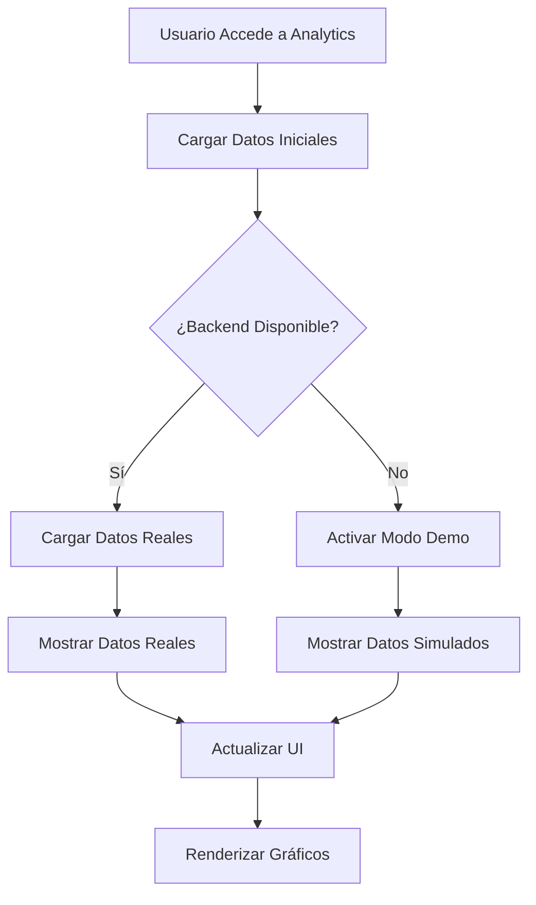
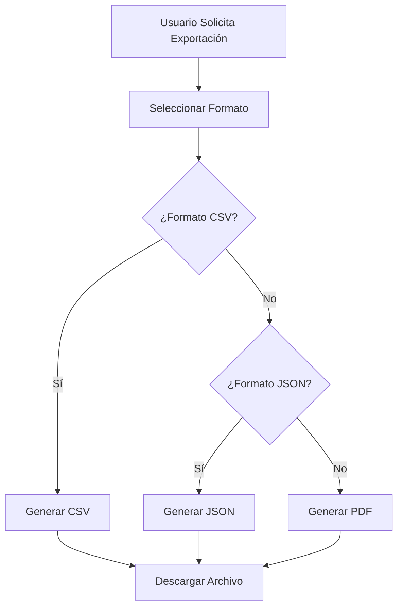
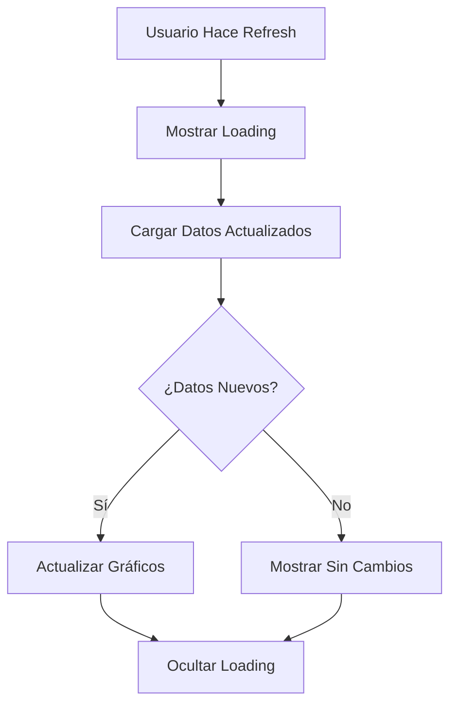

# 📊 Analytics y Reportes - MussikOn Admin System

> **Sistema completo de análisis y reportes con 8 pestañas especializadas y datos mock realistas**

## 📋 Índice

1. [Descripción General](#descripción-general)
2. [Arquitectura del Sistema](#arquitectura-del-sistema)
3. [Funcionalidades Implementadas](#funcionalidades-implementadas)
4. [Pestañas de Analytics](#pestañas-de-analytics)
5. [Componentes del Sistema](#componentes-del-sistema)
6. [Flujos de Trabajo](#flujos-de-trabajo)
7. [Configuración](#configuración)
8. [API Endpoints](#api-endpoints)
9. [Modo Demo](#modo-demo)
10. [Troubleshooting](#troubleshooting)

## 🎯 Descripción General

El Sistema de Analytics de MussikOn Admin System es una solución completa de análisis y reportes que proporciona insights detallados sobre el rendimiento de la plataforma. El sistema incluye 8 pestañas especializadas con gráficos interactivos, métricas clave y datos mock realistas para demostración y desarrollo.

### **Características Principales**
- ✅ **8 Pestañas Especializadas** - Dashboard, Eventos, Solicitudes, Usuarios, Plataforma, Tendencias, Ubicaciones, Top Usuarios
- ✅ **Gráficos Interactivos** - Chart.js con múltiples tipos de visualización
- ✅ **Datos Mock Realistas** - Para demostración y desarrollo
- ✅ **Alertas Informativas** - Notificación cuando se usan datos simulados
- ✅ **Exportación de Datos** - CSV, JSON, PDF
- ✅ **Filtros Avanzados** - Por fecha, categoría, estado
- ✅ **Métricas en Tiempo Real** - Actualización automática de datos
- ✅ **Responsive Design** - Optimizado para todos los dispositivos

## 🏗️ Arquitectura del Sistema

### **Componentes Principales**

```
Sistema de Analytics/
├── 📁 analytics/                   # Módulo principal de analytics
│   ├── index.tsx                  # Componente principal
│   └── components/
│       └── AnalyticsCharts.tsx    # Componentes de gráficos
├── 📁 services/
│   └── analyticsService.ts        # Servicio de analytics
├── 📁 hooks/
│   └── useAnalytics.ts            # Hook para analytics
└── 📁 components/analytics/
    ├── MetricCard.tsx             # Tarjeta de métrica
    ├── LineChart.tsx              # Gráfico de líneas
    ├── BarChart.tsx               # Gráfico de barras
    └── DoughnutChart.tsx          # Gráfico de dona
```

### **Flujo de Datos**

```
Backend API → Analytics Service → useAnalytics Hook → Components → Charts
```

## 🚀 Funcionalidades Implementadas

### **1. Dashboard Principal**
- **Métricas Clave:** KPIs principales de la plataforma
- **Gráficos Resumen:** Visualización de tendencias generales
- **Alertas Importantes:** Notificaciones de eventos críticos
- **Acceso Rápido:** Enlaces a otras pestañas de analytics

### **2. Analytics de Eventos**
- **Tipos de Eventos:** Distribución por categoría
- **Tendencias Mensuales:** Evolución temporal de eventos
- **Estados de Eventos:** Análisis por estado (programado, en curso, completado)
- **Rendimiento:** Métricas de éxito y participación

### **3. Analytics de Solicitudes**
- **Estados de Solicitudes:** Distribución por estado
- **Tendencias de Solicitudes:** Evolución temporal
- **Tipos de Instrumentos:** Análisis por instrumento musical
- **Tiempo de Respuesta:** Métricas de atención

### **4. Analytics de Usuarios**
- **Crecimiento de Usuarios:** Evolución temporal de registros
- **Actividad de Usuarios:** Métricas de engagement
- **Distribución por Rol:** Análisis por tipo de usuario
- **Retención:** Métricas de permanencia

### **5. Analytics de Plataforma**
- **Uso de Recursos:** Métricas de rendimiento del sistema
- **Actividad del Sistema:** Logs y eventos del backend
- **Errores y Bugs:** Análisis de problemas técnicos
- **Optimización:** Métricas de performance

### **6. Analytics de Tendencias**
- **Tendencias Generales:** Evolución de métricas clave
- **Predicciones:** Análisis predictivo básico
- **Comparativas:** Comparación entre períodos
- **Análisis Estacional:** Patrones temporales

### **7. Analytics de Ubicaciones**
- **Distribución Geográfica:** Análisis por ubicación
- **Rendimiento por Región:** Métricas por área geográfica
- **Eventos por Ubicación:** Análisis de eventos por zona
- **Músicos por Región:** Distribución geográfica de músicos

### **8. Top Usuarios**
- **Usuarios Más Activos:** Ranking de actividad
- **Músicos Destacados:** Mejores músicos por métricas
- **Organizadores Top:** Mejores organizadores de eventos
- **Métricas de Rendimiento:** KPIs individuales

## 📦 Pestañas de Analytics

### **1. Dashboard Principal**

#### **Métricas Principales**
- **Total de Usuarios:** Número total de usuarios registrados
- **Eventos Activos:** Eventos en curso o programados
- **Solicitudes Pendientes:** Solicitudes esperando respuesta
- **Ingresos del Mes:** Ingresos generados en el mes actual

#### **Gráficos del Dashboard**
- **Crecimiento de Usuarios:** Gráfico de líneas temporal
- **Distribución de Eventos:** Gráfico de dona por tipo
- **Tendencias de Solicitudes:** Gráfico de barras mensual
- **Rendimiento de la Plataforma:** Gráfico de líneas de métricas

### **2. Analytics de Eventos**

#### **Métricas Específicas**
- **Total de Eventos:** Número total de eventos creados
- **Eventos por Tipo:** Distribución por categoría
- **Tasa de Éxito:** Porcentaje de eventos completados exitosamente
- **Participación Promedio:** Número promedio de participantes

#### **Gráficos de Eventos**
- **Tipos de Eventos:** Gráfico de dona con distribución
- **Tendencias Mensuales:** Gráfico de líneas temporal
- **Estados de Eventos:** Gráfico de barras por estado
- **Rendimiento por Tipo:** Gráfico de barras comparativo

### **3. Analytics de Solicitudes**

#### **Métricas Específicas**
- **Total de Solicitudes:** Número total de solicitudes
- **Solicitudes por Estado:** Distribución por estado
- **Tiempo Promedio de Respuesta:** Métrica de atención
- **Tasa de Aprobación:** Porcentaje de solicitudes aprobadas

#### **Gráficos de Solicitudes**
- **Estados de Solicitudes:** Gráfico de dona con distribución
- **Tendencias de Solicitudes:** Gráfico de líneas temporal
- **Tipos de Instrumentos:** Gráfico de barras por instrumento
- **Tiempo de Respuesta:** Gráfico de líneas de atención

### **4. Analytics de Usuarios**

#### **Métricas Específicas**
- **Crecimiento de Usuarios:** Evolución temporal de registros
- **Usuarios Activos:** Número de usuarios activos
- **Distribución por Rol:** Análisis por tipo de usuario
- **Tasa de Retención:** Métrica de permanencia

#### **Gráficos de Usuarios**
- **Crecimiento de Usuarios:** Gráfico de líneas temporal
- **Distribución por Rol:** Gráfico de dona con roles
- **Actividad de Usuarios:** Gráfico de barras de engagement
- **Retención Mensual:** Gráfico de líneas de retención

### **5. Analytics de Plataforma**

#### **Métricas Específicas**
- **Uso de Recursos:** Métricas de rendimiento del sistema
- **Actividad del Sistema:** Logs y eventos del backend
- **Errores y Bugs:** Análisis de problemas técnicos
- **Tiempo de Respuesta:** Performance del sistema

#### **Gráficos de Plataforma**
- **Uso de Recursos:** Gráfico de líneas de recursos
- **Actividad del Sistema:** Gráfico de barras de logs
- **Errores por Tipo:** Gráfico de dona de errores
- **Performance del Sistema:** Gráfico de líneas de rendimiento

### **6. Analytics de Tendencias**

#### **Métricas Específicas**
- **Tendencias Generales:** Evolución de métricas clave
- **Predicciones:** Análisis predictivo básico
- **Comparativas:** Comparación entre períodos
- **Análisis Estacional:** Patrones temporales

#### **Gráficos de Tendencias**
- **Tendencias Generales:** Gráfico de líneas múltiples
- **Predicciones:** Gráfico de líneas con proyecciones
- **Comparativas:** Gráfico de barras comparativo
- **Análisis Estacional:** Gráfico de líneas estacional

### **7. Analytics de Ubicaciones**

#### **Métricas Específicas**
- **Distribución Geográfica:** Análisis por ubicación
- **Rendimiento por Región:** Métricas por área geográfica
- **Eventos por Ubicación:** Análisis de eventos por zona
- **Músicos por Región:** Distribución geográfica de músicos

#### **Gráficos de Ubicaciones**
- **Distribución Geográfica:** Gráfico de barras por región
- **Rendimiento por Región:** Gráfico de líneas regional
- **Eventos por Ubicación:** Gráfico de dona geográfico
- **Músicos por Región:** Gráfico de barras geográfico

### **8. Top Usuarios**

#### **Métricas Específicas**
- **Usuarios Más Activos:** Ranking de actividad
- **Músicos Destacados:** Mejores músicos por métricas
- **Organizadores Top:** Mejores organizadores de eventos
- **Métricas de Rendimiento:** KPIs individuales

#### **Gráficos de Top Usuarios**
- **Ranking de Actividad:** Gráfico de barras horizontal
- **Músicos Destacados:** Gráfico de barras de rendimiento
- **Organizadores Top:** Gráfico de barras de eventos
- **Métricas Individuales:** Gráfico de líneas personal

## 📊 Componentes del Sistema

### **AnalyticsCharts**
- **MetricCard:** Tarjeta de métrica individual
- **LineChart:** Gráfico de líneas temporal
- **BarChart:** Gráfico de barras comparativo
- **DoughnutChart:** Gráfico de dona para distribución

### **useAnalytics Hook**
- **Estado de Datos:** Loading, error, success
- **Funciones de Actualización:** Refresh de datos
- **Modo Demo:** Detección automática de datos simulados
- **Exportación:** Funciones de exportación

### **Analytics Service**
- **Llamadas a API:** Comunicación con backend
- **Transformación de Datos:** Adaptación de respuestas
- **Manejo de Errores:** Gestión de errores de API
- **Caching:** Almacenamiento temporal de datos

## 🔄 Flujos de Trabajo

### **Flujo de Carga de Datos**



### **Flujo de Exportación**



### **Flujo de Actualización**



## ⚙️ Configuración

### **Variables de Entorno**

```env
# Backend URL para analytics
VITE_API_BASE_URL=http://192.168.100.101:3001

# Configuración de analytics
VITE_ANALYTICS_TIMEOUT=30000
VITE_ANALYTICS_RETRY_ATTEMPTS=3
VITE_ANALYTICS_CACHE_TIME=300000  # 5 minutos
```

### **Configuración de API**

```typescript
// src/config/apiConfig.ts
export const API_CONFIG = {
  ENDPOINTS: {
    // Analytics
    ANALYTICS_DASHBOARD: '/analytics/dashboard',
    ANALYTICS_EVENTS: '/analytics/events',
    ANALYTICS_REQUESTS: '/analytics/requests',
    ANALYTICS_USERS: '/analytics/users',
    ANALYTICS_PLATFORM: '/analytics/platform',
    ANALYTICS_TRENDS: '/analytics/trends',
    ANALYTICS_LOCATIONS: '/analytics/locations',
    ANALYTICS_TOP_USERS: '/analytics/top-users',
    ANALYTICS_EXPORT: '/analytics/export',
  }
};
```

## 🔌 API Endpoints

### **Endpoints de Analytics**

| Método | Endpoint | Descripción |
|--------|----------|-------------|
| GET | `/analytics/dashboard` | Obtener datos del dashboard principal |
| GET | `/analytics/events` | Obtener analytics de eventos |
| GET | `/analytics/requests` | Obtener analytics de solicitudes |
| GET | `/analytics/users` | Obtener analytics de usuarios |
| GET | `/analytics/platform` | Obtener analytics de plataforma |
| GET | `/analytics/trends` | Obtener analytics de tendencias |
| GET | `/analytics/locations` | Obtener analytics de ubicaciones |
| GET | `/analytics/top-users` | Obtener top usuarios |
| POST | `/analytics/export` | Exportar datos de analytics |

### **Parámetros de Consulta**

| Parámetro | Tipo | Descripción |
|-----------|------|-------------|
| `startDate` | string | Fecha de inicio (YYYY-MM-DD) |
| `endDate` | string | Fecha de fin (YYYY-MM-DD) |
| `category` | string | Categoría específica |
| `format` | string | Formato de exportación (csv, json, pdf) |

## 🎭 Modo Demo

### **Activación Automática**
El modo demo se activa automáticamente cuando:
- El backend no está disponible
- Hay errores de permisos (403)
- Hay errores de servidor (500)

### **Datos Simulados**

#### **Dashboard Principal**
```typescript
const mockDashboard = {
  totalUsers: 15420,
  activeEvents: 45,
  pendingRequests: 23,
  monthlyRevenue: 125000,
  userGrowth: [1200, 1350, 1420, 1540, 1680, 1820],
  eventDistribution: {
    concerts: 35,
    weddings: 25,
    corporate: 20,
    private: 20
  },
  requestTrends: [15, 18, 22, 19, 25, 23],
  platformMetrics: [95, 92, 98, 94, 96, 97]
};
```

#### **Analytics de Eventos**
```typescript
const mockEventAnalytics = {
  totalEvents: 342,
  eventsByType: {
    concerts: 120,
    weddings: 85,
    corporate: 67,
    private: 70
  },
  monthlyTrends: [25, 28, 32, 29, 35, 33],
  eventStatus: {
    scheduled: 45,
    inProgress: 12,
    completed: 285
  },
  performanceByType: {
    concerts: 92,
    weddings: 88,
    corporate: 95,
    private: 90
  }
};
```

#### **Analytics de Solicitudes**
```typescript
const mockRequestAnalytics = {
  totalRequests: 156,
  requestsByStatus: {
    pending: 23,
    approved: 98,
    rejected: 35
  },
  monthlyTrends: [12, 15, 18, 14, 20, 19],
  instrumentsByType: {
    guitar: 45,
    piano: 32,
    drums: 28,
    vocals: 51
  },
  responseTime: [2.5, 3.1, 2.8, 2.9, 3.2, 2.7]
};
```

### **Alertas Informativas**
Cuando el modo demo está activo, se muestran alertas informativas:
- **Modo Demo Activado:** Explicación de por qué se usan datos simulados
- **Datos Realistas:** Los datos simulados son realistas y representativos
- **Funcionalidad Completa:** Todas las funciones están disponibles

## 🔧 Troubleshooting

### **Problemas Comunes**

#### **Datos No Cargados**
- **Causa:** Problemas de red o API
- **Solución:** Verificar conectividad y endpoints
- **Workaround:** El modo demo proporciona datos simulados

#### **Gráficos No Renderizados**
- **Causa:** Problemas con Chart.js o datos
- **Solución:** Verificar datos y configuración de gráficos
- **Workaround:** Los gráficos funcionan con datos simulados

#### **Exportación Fallida**
- **Causa:** Problemas de permisos o formato
- **Solución:** Verificar permisos y formato de exportación
- **Workaround:** Exportación simulada en modo demo

### **Logs de Debugging**

```typescript
// Logs importantes para debugging
console.log('📊 Cargando datos de analytics...');
console.log('🔧 Activando modo demo debido a error de API');
console.log('✅ Datos de analytics cargados exitosamente');
console.log('❌ Error cargando analytics:', error);
console.log('📈 Renderizando gráficos con datos:', data);
```

### **Verificación de Estado**

```bash
# Verificar conectividad con backend
npm run check-backend

# Verificar build del proyecto
npm run build

# Verificar linting
npm run lint
```

## 📈 Métricas y Reportes

### **Métricas Disponibles**

#### **Dashboard Principal**
- **Total de Usuarios:** Número total de usuarios registrados
- **Eventos Activos:** Eventos en curso o programados
- **Solicitudes Pendientes:** Solicitudes esperando respuesta
- **Ingresos del Mes:** Ingresos generados en el mes actual

#### **Métricas por Pestaña**
- **Eventos:** Total, tipos, estados, rendimiento
- **Solicitudes:** Total, estados, instrumentos, tiempo de respuesta
- **Usuarios:** Crecimiento, actividad, roles, retención
- **Plataforma:** Recursos, actividad, errores, performance
- **Tendencias:** Evolución, predicciones, comparativas
- **Ubicaciones:** Distribución geográfica, rendimiento regional
- **Top Usuarios:** Rankings, métricas individuales

### **Reportes Disponibles**

#### **Exportación de Datos**
- **CSV:** Datos tabulares para análisis en Excel
- **JSON:** Datos estructurados para integración
- **PDF:** Reportes formateados para presentación

#### **Filtros de Reportes**
- **Por Fecha:** Rango de fechas específico
- **Por Categoría:** Filtrar por tipo de evento o solicitud
- **Por Estado:** Filtrar por estado de eventos o solicitudes
- **Por Ubicación:** Filtrar por región geográfica

## 🎯 Próximos Pasos

### **Mejoras Planificadas**
1. **Datos Reales:** Conectar con backend real
2. **Actualización en Tiempo Real:** WebSockets para datos live
3. **Análisis Predictivo:** Machine learning básico
4. **Reportes Personalizados:** Configuración de reportes
5. **Alertas Inteligentes:** Notificaciones automáticas

### **Optimizaciones**
1. **Performance:** Caching y lazy loading de gráficos
2. **UX:** Mejoras en la interfaz de usuario
3. **Accesibilidad:** Mejoras para usuarios con discapacidades
4. **Escalabilidad:** Optimización para grandes volúmenes de datos

### **Nuevas Funcionalidades**
1. **Dashboard Personalizable:** Widgets configurables
2. **Análisis Avanzado:** Métricas más complejas
3. **Comparativas:** Comparación entre períodos
4. **Alertas:** Notificaciones de métricas críticas
5. **Integración:** Conectores con herramientas externas

---

**📊 Analytics y Reportes** - MussikOn Admin System  
**Versión:** 2.0.0  
**Estado:** Completamente implementado con datos simulados 