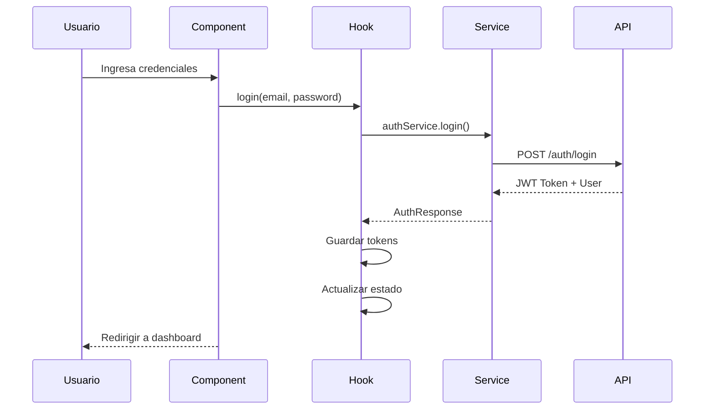
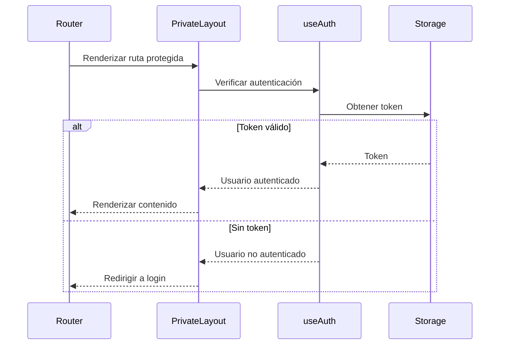
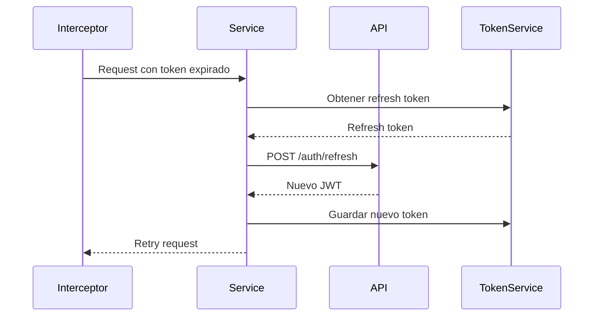

# 🔐 **Sistema de Autenticación - MussikOn Admin System**

> **Sistema completo de autenticación con JWT**  
> **Versión:** 1.0.0 | **Última Actualización:** Enero 2025

---

## 📋 **Índice**

1. [Descripción General](#descripción-general)
2. [Arquitectura del Sistema](#arquitectura-del-sistema)
3. [Componentes](#componentes)
4. [Servicios](#servicios)
5. [Hooks](#hooks)
6. [Flujo de Autenticación](#flujo-de-autenticación)
7. [Configuración](#configuración)
8. [Seguridad](#seguridad)
9. [Solución de Problemas](#solución-de-problemas)

---

## 🎯 **Descripción General**

El sistema de autenticación de MussikOn Admin System proporciona una solución completa y segura para la gestión de usuarios, incluyendo:

- **Login/Logout** con JWT
- **Refresh tokens** automáticos
- **Protección de rutas** privadas
- **Gestión de sesiones** persistente
- **Recuperación de contraseñas**
- **Roles y permisos**

---

## 🏗️ **Arquitectura del Sistema**

### **Stack Tecnológico**
```
Autenticación:
├── JWT (JSON Web Tokens)
├── Refresh Tokens
├── Local Storage (Persistencia)
├── React Context (Estado Global)
├── Axios Interceptors (HTTP)
└── React Router (Protección de Rutas)
```

### **Flujo de Datos**
```
Login → Validación → JWT Token → Local Storage → Context → Protected Routes
```

---

## 🧩 **Componentes**

### **Login Component**
```typescript
// src/features/auth/index.tsx
import React, { useState } from 'react';
import { useAuth } from '@/hooks/useAuth';

export const Login = () => {
  const [email, setEmail] = useState('');
  const [password, setPassword] = useState('');
  const { login, loading, error } = useAuth();

  const handleSubmit = async (e: React.FormEvent) => {
    e.preventDefault();
    await login(email, password);
  };

  return (
    <div className="login-container">
      <form onSubmit={handleSubmit}>
        <input
          type="email"
          value={email}
          onChange={(e) => setEmail(e.target.value)}
          placeholder="Email"
          required
        />
        <input
          type="password"
          value={password}
          onChange={(e) => setPassword(e.target.value)}
          placeholder="Password"
          required
        />
        <button type="submit" disabled={loading}>
          {loading ? 'Iniciando sesión...' : 'Iniciar Sesión'}
        </button>
        {error && <div className="error">{error}</div>}
      </form>
    </div>
  );
};
```

### **Protected Route Component**
```typescript
// src/components/PrivateLayout.tsx
import React from 'react';
import { Navigate, useLocation } from 'react-router-dom';
import { useAuth } from '@/hooks/useAuth';

interface PrivateLayoutProps {
  children: React.ReactNode;
}

export const PrivateLayout: React.FC<PrivateLayoutProps> = ({ children }) => {
  const { user, loading } = useAuth();
  const location = useLocation();

  if (loading) {
    return <div>Cargando...</div>;
  }

  if (!user) {
    return <Navigate to="/login" state={{ from: location }} replace />;
  }

  return <>{children}</>;
};
```

---

## 🔧 **Servicios**

### **Auth Service**
```typescript
// src/services/authService.ts
import { httpClient } from './httpClient';
import { API_CONFIG } from '@/config/apiConfig';

export interface LoginCredentials {
  email: string;
  password: string;
}

export interface AuthResponse {
  token: string;
  refreshToken: string;
  user: {
    id: string;
    email: string;
    name: string;
    role: string;
  };
}

export const authService = {
  async login(credentials: LoginCredentials): Promise<AuthResponse> {
    const response = await httpClient.post(
      API_CONFIG.ENDPOINTS.AUTH.LOGIN,
      credentials
    );
    return response.data;
  },

  async refreshToken(refreshToken: string): Promise<AuthResponse> {
    const response = await httpClient.post(
      API_CONFIG.ENDPOINTS.AUTH.REFRESH,
      { refreshToken }
    );
    return response.data;
  },

  async logout(): Promise<void> {
    await httpClient.post(API_CONFIG.ENDPOINTS.AUTH.LOGOUT);
  },

  async forgotPassword(email: string): Promise<void> {
    await httpClient.post('/auth/forgot-password', { email });
  },

  async resetPassword(token: string, password: string): Promise<void> {
    await httpClient.post('/auth/reset-password', { token, password });
  }
};
```

### **Token Management**
```typescript
// src/services/tokenService.ts
export const tokenService = {
  getToken(): string | null {
    return localStorage.getItem('mussikon_token');
  },

  setToken(token: string): void {
    localStorage.setItem('mussikon_token', token);
  },

  getRefreshToken(): string | null {
    return localStorage.getItem('mussikon_refresh_token');
  },

  setRefreshToken(token: string): void {
    localStorage.setItem('mussikon_refresh_token', token);
  },

  clearTokens(): void {
    localStorage.removeItem('mussikon_token');
    localStorage.removeItem('mussikon_refresh_token');
  },

  isTokenExpired(token: string): boolean {
    try {
      const payload = JSON.parse(atob(token.split('.')[1]));
      return payload.exp * 1000 < Date.now();
    } catch {
      return true;
    }
  }
};
```

---

## 🎣 **Hooks**

### **useAuth Hook**
```typescript
// src/hooks/useAuth.ts
import { useState, useEffect, useCallback } from 'react';
import { authService, LoginCredentials, AuthResponse } from '@/services/authService';
import { tokenService } from '@/services/tokenService';

export function useAuth() {
  const [user, setUser] = useState<any>(null);
  const [loading, setLoading] = useState(true);
  const [error, setError] = useState<string | null>(null);

  const login = useCallback(async (email: string, password: string) => {
    try {
      setLoading(true);
      setError(null);
      
      const response: AuthResponse = await authService.login({ email, password });
      
      tokenService.setToken(response.token);
      tokenService.setRefreshToken(response.refreshToken);
      setUser(response.user);
      
      return response;
    } catch (err: any) {
      setError(err.response?.data?.message || 'Error al iniciar sesión');
      throw err;
    } finally {
      setLoading(false);
    }
  }, []);

  const logout = useCallback(async () => {
    try {
      await authService.logout();
    } catch (err) {
      console.error('Error en logout:', err);
    } finally {
      tokenService.clearTokens();
      setUser(null);
    }
  }, []);

  const refreshAuth = useCallback(async () => {
    const refreshToken = tokenService.getRefreshToken();
    if (!refreshToken) {
      setLoading(false);
      return;
    }

    try {
      const response = await authService.refreshToken(refreshToken);
      tokenService.setToken(response.token);
      tokenService.setRefreshToken(response.refreshToken);
      setUser(response.user);
    } catch (err) {
      tokenService.clearTokens();
      setUser(null);
    } finally {
      setLoading(false);
    }
  }, []);

  useEffect(() => {
    const token = tokenService.getToken();
    if (token && !tokenService.isTokenExpired(token)) {
      // Token válido, cargar usuario
      refreshAuth();
    } else {
      setLoading(false);
    }
  }, [refreshAuth]);

  return {
    user,
    loading,
    error,
    login,
    logout,
    refreshAuth,
    isAuthenticated: !!user
  };
}
```

---

## 🔄 **Flujo de Autenticación**

### **1. Login**


### **2. Protección de Rutas**


### **3. Refresh Token**


---

## ⚙️ **Configuración**

### **Auth Configuration**
```typescript
// src/config/authConfig.ts
export const AUTH_CONFIG = {
  TOKEN_KEY: 'mussikon_token',
  REFRESH_TOKEN_KEY: 'mussikon_refresh_token',
  TOKEN_EXPIRY: 3600, // 1 hora
  REFRESH_TOKEN_EXPIRY: 604800, // 7 días
  AUTO_REFRESH: true,
  LOGOUT_ON_EXPIRY: true,
  PERSIST_SESSION: true
};
```

### **HTTP Interceptors**
```typescript
// src/services/httpClient.ts
import axios from 'axios';
import { tokenService } from './tokenService';
import { authService } from './authService';

const httpClient = axios.create({
  baseURL: API_CONFIG.BASE_URL,
  timeout: 10000
});

// Request interceptor
httpClient.interceptors.request.use(
  (config) => {
    const token = tokenService.getToken();
    if (token) {
      config.headers.Authorization = `Bearer ${token}`;
    }
    return config;
  },
  (error) => Promise.reject(error)
);

// Response interceptor
httpClient.interceptors.response.use(
  (response) => response,
  async (error) => {
    const originalRequest = error.config;

    if (error.response?.status === 401 && !originalRequest._retry) {
      originalRequest._retry = true;

      try {
        const refreshToken = tokenService.getRefreshToken();
        if (refreshToken) {
          const response = await authService.refreshToken(refreshToken);
          tokenService.setToken(response.token);
          tokenService.setRefreshToken(response.refreshToken);
          
          originalRequest.headers.Authorization = `Bearer ${response.token}`;
          return httpClient(originalRequest);
        }
      } catch (refreshError) {
        tokenService.clearTokens();
        window.location.href = '/login';
        return Promise.reject(refreshError);
      }
    }

    return Promise.reject(error);
  }
);
```

---

## 🔒 **Seguridad**

### **Medidas de Seguridad Implementadas**

1. **JWT Tokens**
   - Tokens de acceso de corta duración (1 hora)
   - Refresh tokens de larga duración (7 días)
   - Almacenamiento seguro en localStorage

2. **Protección de Rutas**
   - Middleware de autenticación
   - Redirección automática a login
   - Protección de rutas privadas

3. **Manejo de Errores**
   - Interceptores de HTTP
   - Refresh automático de tokens
   - Logout automático en errores 401

4. **Validación**
   - Validación de formularios
   - Sanitización de inputs
   - Verificación de tokens

### **Buenas Prácticas**
```typescript
// Validación de formularios
const validateLogin = (email: string, password: string) => {
  const errors: string[] = [];
  
  if (!email || !email.includes('@')) {
    errors.push('Email inválido');
  }
  
  if (!password || password.length < 6) {
    errors.push('Contraseña debe tener al menos 6 caracteres');
  }
  
  return errors;
};

// Sanitización de inputs
const sanitizeInput = (input: string): string => {
  return input.trim().replace(/[<>]/g, '');
};
```

---

## 🚨 **Solución de Problemas**

### **Problemas Comunes**

#### **Error 401 - Token Expirado**
```typescript
// Solución: Refresh automático implementado
// Verificar en interceptors de HTTP
```

#### **Error de CORS**
```bash
# Solución: Configurar CORS en backend
# O usar proxy en desarrollo
```

#### **Error de LocalStorage**
```typescript
// Solución: Verificar disponibilidad
const isLocalStorageAvailable = () => {
  try {
    localStorage.setItem('test', 'test');
    localStorage.removeItem('test');
    return true;
  } catch {
    return false;
  }
};
```

#### **Error de Refresh Token**
```typescript
// Solución: Limpiar tokens y redirigir
const handleRefreshError = () => {
  tokenService.clearTokens();
  window.location.href = '/login';
};
```

### **Debugging**
```typescript
// Habilitar logs de debug
const DEBUG_AUTH = import.meta.env.VITE_DEBUG_AUTH === 'true';

if (DEBUG_AUTH) {
  console.log('Auth Debug:', {
    user,
    token: tokenService.getToken() ? 'Present' : 'Missing',
    refreshToken: tokenService.getRefreshToken() ? 'Present' : 'Missing'
  });
}
```

---

## 📚 **Referencias**

- **[JWT Documentation](https://jwt.io/)**
- **[React Router Auth](https://reactrouter.com/docs/en/v6/examples/auth)**
- **[Axios Interceptors](https://axios-http.com/docs/interceptors)**
- **[Local Storage API](https://developer.mozilla.org/en-US/docs/Web/API/Window/localStorage)**

---

## ✅ **Checklist de Implementación**

- [x] Sistema de login/logout
- [x] JWT tokens
- [x] Refresh tokens
- [x] Protección de rutas
- [x] Interceptores HTTP
- [x] Manejo de errores
- [x] Persistencia de sesión
- [x] Validación de formularios
- [x] Logout automático
- [x] Debugging tools

---

**Sistema de autenticación implementado y funcional** ✅ 