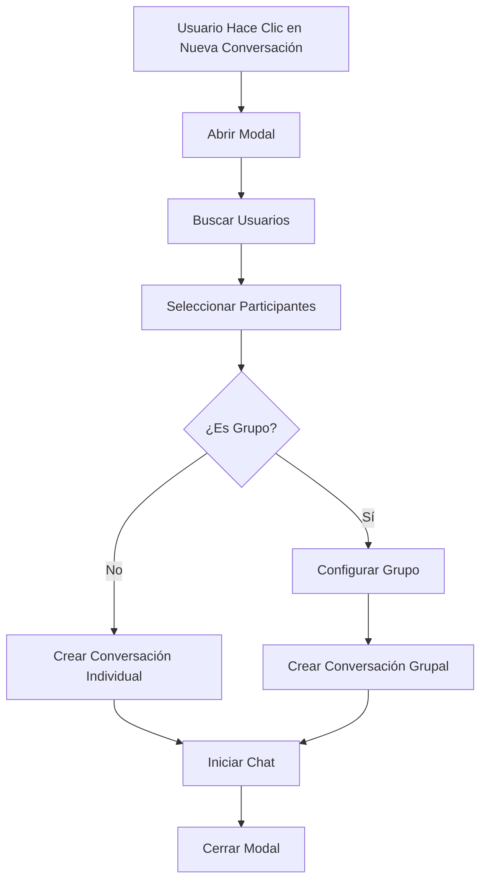
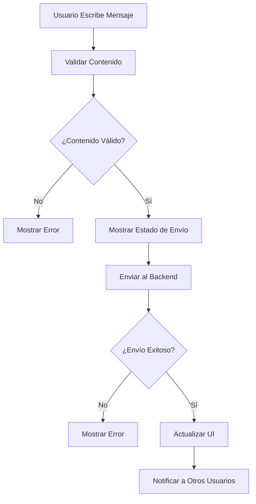
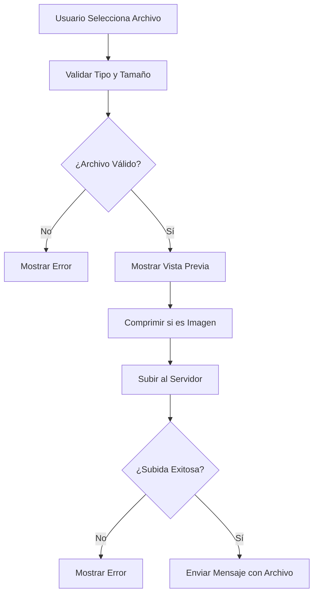

# 💬 Sistema de Chat - MussikOn Admin System

> **Sistema completo de mensajería en tiempo real para comunicación entre administradores y usuarios**

## 📋 Índice

1. [Descripción General](#descripción-general)
2. [Arquitectura del Sistema](#arquitectura-del-sistema)
3. [Funcionalidades Implementadas](#funcionalidades-implementadas)
4. [Componentes del Sistema](#componentes-del-sistema)
5. [Flujos de Trabajo](#flujos-de-trabajo)
6. [Configuración](#configuración)
7. [API Endpoints](#api-endpoints)
8. [Estados y Tipos](#estados-y-tipos)
9. [Modo Demo](#modo-demo)
10. [Troubleshooting](#troubleshooting)

## 🎯 Descripción General

El Sistema de Chat de MussikOn Admin System es una solución completa de mensajería que permite a los administradores comunicarse con usuarios de la plataforma en tiempo real. El sistema incluye conversaciones individuales y grupales, subida de archivos, búsqueda de mensajes y una interfaz responsive optimizada para todos los dispositivos.

### **Características Principales**
- ✅ **Conversaciones Individuales y Grupales** - Flexibilidad total en tipos de chat
- ✅ **Mensajes en Tiempo Real** - Comunicación instantánea
- ✅ **Subida de Archivos** - Imágenes y documentos
- ✅ **Búsqueda de Mensajes** - Búsqueda en conversaciones
- ✅ **Interfaz Responsive** - Optimizada para móviles y desktop
- ✅ **Datos Simulados** - Para demostración y desarrollo
- ✅ **Estados de Escritura** - Indicadores de actividad
- ✅ **Historial Completo** - Mensajes persistentes

## 🏗️ Arquitectura del Sistema

### **Componentes Principales**

```
Sistema de Chat/
├── 📁 chat/                       # Módulo principal de chat
│   ├── index.tsx                 # Componente principal
│   └── components/
│       ├── ChatHeader.tsx        # Header del chat
│       ├── ChatWindow.tsx        # Ventana principal del chat
│       ├── ConversationList.tsx  # Lista de conversaciones
│       ├── MessageList.tsx       # Lista de mensajes
│       ├── MessageBubble.tsx     # Burbuja de mensaje individual
│       ├── MessageInput.tsx      # Input para escribir mensajes
│       └── NewConversationModal.tsx # Modal para nuevas conversaciones
├── 📁 services/
│   └── chatService.ts            # Servicio de chat
└── 📁 hooks/
    └── useChat.ts                # Hook para chat
```

### **Flujo de Datos**

```
Usuario → Chat Input → Chat Service → Backend → Otros Usuarios → Real-time Update
```

## 🚀 Funcionalidades Implementadas

### **1. Gestión de Conversaciones**
- **Lista de Conversaciones:** Vista general de todos los chats
- **Conversaciones Individuales:** Chat uno a uno
- **Conversaciones Grupales:** Chat con múltiples participantes
- **Estados de Conversación:** Activa, archivada, eliminada
- **Búsqueda de Conversaciones:** Filtrar por nombre o contenido

### **2. Sistema de Mensajería**
- **Mensajes en Tiempo Real:** Comunicación instantánea
- **Tipos de Mensaje:** Texto, imágenes, documentos
- **Estados de Mensaje:** Enviado, Entregado, Leído
- **Edición de Mensajes:** Modificar mensajes enviados
- **Eliminación de Mensajes:** Borrar mensajes propios

### **3. Subida de Archivos**
- **Imágenes:** Soporte para formatos comunes (JPG, PNG, GIF)
- **Documentos:** PDF, DOC, TXT, etc.
- **Vista Previa:** Visualización antes del envío
- **Tamaño Máximo:** Límites configurables
- **Compresión Automática:** Optimización de imágenes

### **4. Búsqueda y Filtros**
- **Búsqueda de Mensajes:** Buscar en conversaciones activas
- **Filtros por Tipo:** Texto, imágenes, documentos
- **Filtros por Fecha:** Buscar en rangos temporales
- **Búsqueda de Usuarios:** Encontrar usuarios para nuevas conversaciones

### **5. Interfaz de Usuario**
- **Diseño Responsive:** Optimizado para móviles y desktop
- **Navegación Intuitiva:** Fácil cambio entre conversaciones
- **Indicadores Visuales:** Estados de mensajes y actividad
- **Temas Adaptativos:** Integración con el tema del sistema

## 📦 Componentes del Sistema

### **ChatHeader**
- **Título de Conversación:** Nombre del usuario o grupo
- **Botón Nueva Conversación:** Abrir modal de creación
- **Búsqueda:** Buscar en conversaciones
- **Información de Estado:** Online/offline, última actividad

### **ConversationList**
- **Lista de Conversaciones:** Todas las conversaciones activas
- **Indicadores de Estado:** Mensajes no leídos, última actividad
- **Filtros:** Por tipo de conversación, estado
- **Búsqueda:** Filtrar conversaciones por nombre

### **ChatWindow**
- **Área de Mensajes:** Visualización de la conversación
- **Scroll Automático:** Navegación automática a nuevos mensajes
- **Carga Lazy:** Carga progresiva de mensajes antiguos
- **Indicadores de Escritura:** "Usuario está escribiendo..."

### **MessageList**
- **Renderizado de Mensajes:** Diferentes tipos de mensaje
- **Agrupación Temporal:** Mensajes por fecha
- **Estados de Entrega:** Indicadores visuales
- **Acciones de Mensaje:** Editar, eliminar, responder

### **MessageBubble**
- **Diseño Adaptativo:** Diferentes estilos para enviado/recibido
- **Tipos de Contenido:** Texto, imagen, documento
- **Información Temporal:** Fecha y hora del mensaje
- **Acciones Contextuales:** Menú de opciones

### **MessageInput**
- **Input de Texto:** Área para escribir mensajes
- **Botones de Acción:** Adjuntar archivo, enviar voz, emojis
- **Validación:** Verificación de contenido antes del envío
- **Estados de Envío:** Loading, éxito, error

### **NewConversationModal**
- **Selección de Usuarios:** Buscar y seleccionar participantes
- **Configuración de Grupo:** Nombre, descripción, avatar
- **Validación:** Verificar participantes seleccionados
- **Creación Inmediata:** Iniciar conversación al crear

## 🔄 Flujos de Trabajo

### **Flujo de Creación de Conversación**



### **Flujo de Envío de Mensaje**



### **Flujo de Subida de Archivo**



## ⚙️ Configuración

### **Variables de Entorno**

```env
# Backend URL para chat
VITE_API_BASE_URL=http://192.168.100.101:3001

# Configuración de chat
VITE_CHAT_TIMEOUT=30000
VITE_CHAT_RETRY_ATTEMPTS=3
VITE_MAX_FILE_SIZE=10485760  # 10MB
VITE_ALLOWED_FILE_TYPES=image/*,application/pdf,text/*
```

### **Configuración de API**

```typescript
// src/config/apiConfig.ts
export const API_CONFIG = {
  ENDPOINTS: {
    // Chat
    CONVERSATIONS: '/chat/conversations',
    MESSAGES: '/chat/conversations/:id/messages',
    SEND_MESSAGE: '/chat/conversations/:id/messages',
    UPLOAD_FILE: '/chat/upload',
    SEARCH_MESSAGES: '/chat/search',
  }
};

export const SOCKET_CONFIG = {
  EVENTS: {
    MESSAGE_SENT: 'message_sent',
    MESSAGE_RECEIVED: 'message_received',
    TYPING_START: 'typing_start',
    TYPING_STOP: 'typing_stop',
    USER_ONLINE: 'user_online',
    USER_OFFLINE: 'user_offline',
  }
};
```

## 🔌 API Endpoints

### **Endpoints de Chat**

| Método | Endpoint | Descripción |
|--------|----------|-------------|
| GET | `/chat/conversations` | Obtener lista de conversaciones |
| POST | `/chat/conversations` | Crear nueva conversación |
| GET | `/chat/conversations/:id` | Obtener conversación específica |
| DELETE | `/chat/conversations/:id` | Eliminar conversación |
| GET | `/chat/conversations/:id/messages` | Obtener mensajes de conversación |
| POST | `/chat/conversations/:id/messages` | Enviar mensaje |
| PUT | `/chat/messages/:id` | Editar mensaje |
| DELETE | `/chat/messages/:id` | Eliminar mensaje |
| POST | `/chat/upload` | Subir archivo |
| GET | `/chat/search` | Buscar mensajes |

### **Eventos de Socket.IO**

| Evento | Descripción | Payload |
|--------|-------------|---------|
| `message_sent` | Mensaje enviado | `{ conversationId, message }` |
| `message_received` | Mensaje recibido | `{ conversationId, message }` |
| `typing_start` | Usuario empezó a escribir | `{ conversationId, userId }` |
| `typing_stop` | Usuario dejó de escribir | `{ conversationId, userId }` |
| `user_online` | Usuario conectado | `{ userId, timestamp }` |
| `user_offline` | Usuario desconectado | `{ userId, timestamp }` |

## 📊 Estados y Tipos

### **Tipos de Conversación**

```typescript
type ConversationType = 'individual' | 'group';

interface Conversation {
  id: string;
  type: ConversationType;
  name?: string; // Para grupos
  participants: string[];
  lastMessage?: Message;
  unreadCount: number;
  createdAt: string;
  updatedAt: string;
}
```

### **Tipos de Mensaje**

```typescript
type MessageType = 'text' | 'image' | 'document' | 'system';

type MessageStatus = 'sending' | 'sent' | 'delivered' | 'read' | 'error';

interface Message {
  id: string;
  conversationId: string;
  senderId: string;
  type: MessageType;
  content: string;
  fileUrl?: string;
  fileName?: string;
  fileSize?: number;
  status: MessageStatus;
  createdAt: string;
  updatedAt: string;
}
```

### **Estados de Usuario**

```typescript
type UserStatus = 'online' | 'offline' | 'away' | 'busy';

interface User {
  id: string;
  name: string;
  email: string;
  avatar?: string;
  status: UserStatus;
  lastSeen?: string;
}
```

## 🎭 Modo Demo

### **Activación Automática**
El modo demo se activa automáticamente cuando:
- El backend no está disponible
- Hay errores de permisos (403)
- Hay errores de servidor (500)

### **Datos Simulados**

#### **Conversaciones de Ejemplo**
```typescript
const mockConversations: Conversation[] = [
  {
    id: 'conv_001',
    type: 'individual',
    participants: ['admin_001', 'user_123'],
    lastMessage: {
      id: 'msg_001',
      conversationId: 'conv_001',
      senderId: 'user_123',
      type: 'text',
      content: 'Hola, necesito ayuda con mi cuenta',
      status: 'read',
      createdAt: new Date().toISOString(),
      updatedAt: new Date().toISOString()
    },
    unreadCount: 0,
    createdAt: new Date().toISOString(),
    updatedAt: new Date().toISOString()
  }
];
```

#### **Mensajes de Ejemplo**
```typescript
const mockMessages: Message[] = [
  {
    id: 'msg_001',
    conversationId: 'conv_001',
    senderId: 'user_123',
    type: 'text',
    content: 'Hola, necesito ayuda con mi cuenta',
    status: 'read',
    createdAt: new Date().toISOString(),
    updatedAt: new Date().toISOString()
  },
  {
    id: 'msg_002',
    conversationId: 'conv_001',
    senderId: 'admin_001',
    type: 'text',
    content: 'Hola! Te ayudo con eso. ¿Qué problema tienes?',
    status: 'read',
    createdAt: new Date().toISOString(),
    updatedAt: new Date().toISOString()
  }
];
```

#### **Usuarios de Ejemplo**
```typescript
const mockUsers: User[] = [
  {
    id: 'user_123',
    name: 'Juan Pérez',
    email: 'juan@example.com',
    avatar: 'https://example.com/avatar1.jpg',
    status: 'online',
    lastSeen: new Date().toISOString()
  },
  {
    id: 'user_456',
    name: 'María García',
    email: 'maria@example.com',
    avatar: 'https://example.com/avatar2.jpg',
    status: 'offline',
    lastSeen: new Date(Date.now() - 3600000).toISOString()
  }
];
```

### **Funcionalidades Simuladas**
- **Envío de Mensajes:** Simulación de envío exitoso
- **Recepción de Mensajes:** Mensajes automáticos de respuesta
- **Estados de Escritura:** Simulación de "usuario escribiendo..."
- **Subida de Archivos:** Simulación de carga exitosa
- **Búsqueda:** Filtrado local de datos simulados

## 🔧 Troubleshooting

### **Problemas Comunes**

#### **Error de Conexión WebSocket**
- **Causa:** Servidor Socket.IO no disponible
- **Solución:** Verificar URL del servidor Socket.IO
- **Workaround:** El modo demo funciona sin WebSockets

#### **Mensajes No Enviados**
- **Causa:** Problemas de red o API
- **Solución:** Verificar conectividad y endpoints
- **Workaround:** Los mensajes se simulan en modo demo

#### **Archivos No Subidos**
- **Causa:** Límites de tamaño o tipo no permitido
- **Solución:** Verificar configuración de archivos
- **Workaround:** Simulación de subida en modo demo

### **Logs de Debugging**

```typescript
// Logs importantes para debugging
console.log('💬 Iniciando sistema de chat...');
console.log('📡 Conectando a WebSocket...');
console.log('✅ Mensaje enviado exitosamente');
console.log('❌ Error enviando mensaje:', error);
console.log('📁 Subiendo archivo:', fileName);
```

### **Verificación de Estado**

```bash
# Verificar conectividad con backend
npm run check-backend

# Verificar build del proyecto
npm run build

# Verificar linting
npm run lint
```

## 📈 Métricas y Estadísticas

### **Métricas Disponibles**

#### **Dashboard de Chat**
- **Total de Conversaciones:** Número total de chats activos
- **Mensajes Enviados:** Total de mensajes en el sistema
- **Usuarios Activos:** Usuarios conectados actualmente
- **Tiempo Promedio de Respuesta:** Métrica de atención

#### **Estadísticas por Conversación**
- **Número de Mensajes:** Cantidad de mensajes por chat
- **Participantes Activos:** Usuarios que participan regularmente
- **Tiempo de Respuesta:** Tiempo promedio de respuesta
- **Tipos de Mensaje:** Distribución por tipo de contenido

### **Reportes Disponibles**

#### **Exportación de Conversaciones**
- **CSV:** Datos tabulares de conversaciones
- **JSON:** Datos estructurados para análisis
- **PDF:** Reportes formateados de conversaciones

#### **Filtros de Reportes**
- **Por Fecha:** Rango de fechas específico
- **Por Usuario:** Conversaciones específicas de usuario
- **Por Tipo:** Individuales vs grupales
- **Por Estado:** Activas, archivadas, eliminadas

## 🎯 Próximos Pasos

### **Mejoras Planificadas**
1. **WebSockets Reales:** Integración con Socket.IO del backend
2. **Notificaciones Push:** Alertas en tiempo real
3. **Cifrado de Mensajes:** Seguridad adicional
4. **Videollamadas:** Integración de video chat
5. **Bots Automáticos:** Respuestas automáticas

### **Optimizaciones**
1. **Performance:** Caching de conversaciones frecuentes
2. **UX:** Mejoras en la interfaz de usuario
3. **Seguridad:** Validaciones adicionales
4. **Escalabilidad:** Optimización para grandes volúmenes

### **Nuevas Funcionalidades**
1. **Reacciones:** Emojis en mensajes
2. **Respuestas:** Responder mensajes específicos
3. **Pins:** Mensajes importantes fijados
4. **Archivos:** Mejor gestión de archivos
5. **Temas:** Personalización de apariencia

---

**💬 Sistema de Chat** - MussikOn Admin System  
**Versión:** 2.0.0  
**Estado:** Completamente implementado con datos simulados 