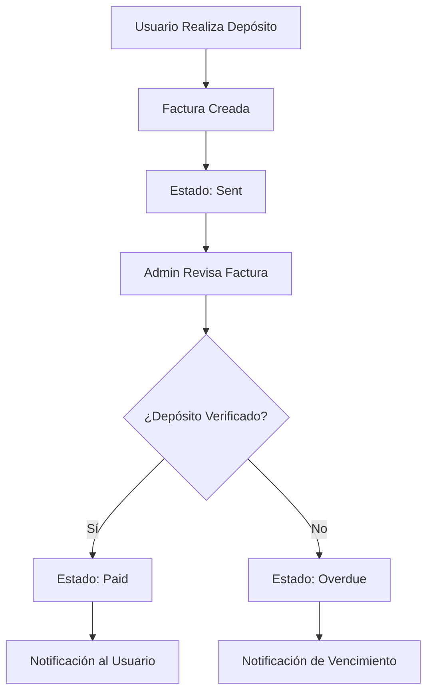
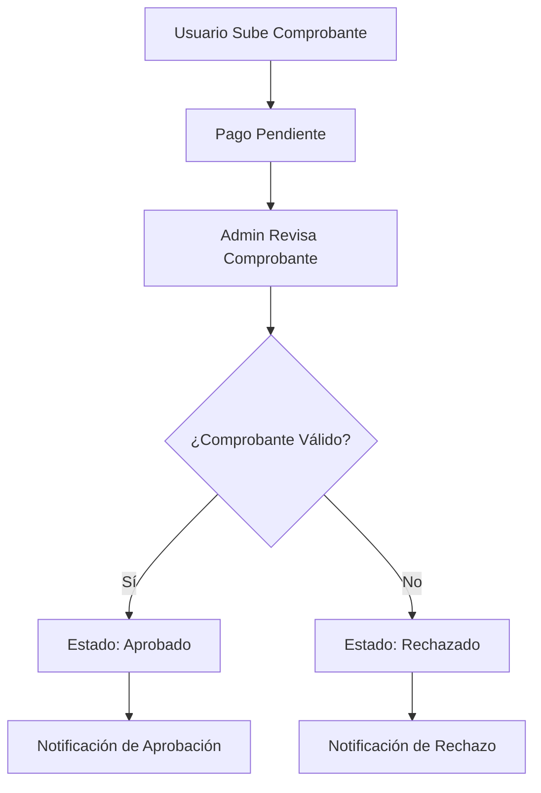

# 💳 Sistema de Pagos - MussikOn Admin System

> **Sistema completo de gestión de pagos con verificación de depósitos por administradores**

## 📋 Índice

1. [Descripción General](#descripción-general)
2. [Arquitectura del Sistema](#arquitectura-del-sistema)
3. [Funcionalidades Implementadas](#funcionalidades-implementadas)
4. [Módulos del Sistema](#módulos-del-sistema)
5. [Flujos de Trabajo](#flujos-de-trabajo)
6. [Configuración](#configuración)
7. [API Endpoints](#api-endpoints)
8. [Estados y Transiciones](#estados-y-transiciones)
9. [Modo Demo](#modo-demo)
10. [Troubleshooting](#troubleshooting)

## 🎯 Descripción General

El Sistema de Pagos de MussikOn Admin System es una solución completa para la gestión de transacciones financieras, incluyendo verificación de depósitos, gestión de facturas, métodos de pago y transacciones. El sistema está diseñado para permitir a los administradores verificar manualmente los depósitos de los usuarios y gestionar todo el flujo financiero de la plataforma.

### **Características Principales**
- ✅ **Verificación Manual de Depósitos** - Proceso controlado por administradores
- ✅ **Gestión de Facturas** - Estados, filtros, verificación
- ✅ **Métodos de Pago** - Tarjetas, cuentas bancarias, PayPal
- ✅ **Transacciones** - Historial completo con estados
- ✅ **Pagos Móviles** - Verificación de pagos desde app móvil
- ✅ **Modo Demo** - Datos simulados cuando el backend no está disponible
- ✅ **Notas de Verificación** - Documentación de procesos
- ✅ **Estadísticas Financieras** - Reportes detallados

## 🏗️ Arquitectura del Sistema

### **Componentes Principales**

```
Sistema de Pagos/
├── 📁 payments/                    # Módulo principal de pagos
│   ├── index.tsx                  # Componente principal
│   └── components/
│       └── DepositVerification.tsx # Verificación de depósitos
├── 📁 mobilePayments/             # Módulo de pagos móviles
│   └── index.tsx                  # Componente principal
├── 📁 services/
│   ├── paymentService.ts          # Servicio de pagos
│   └── mobilePaymentsService.ts   # Servicio de pagos móviles
└── 📁 hooks/
    └── useMobilePayments.ts       # Hook para pagos móviles
```

### **Flujo de Datos**

```
Usuario → App Móvil → Backend → Admin Panel → Verificación → Confirmación
```

## 🚀 Funcionalidades Implementadas

### **1. Verificación de Depósitos**
- **Proceso Manual:** Los administradores verifican depósitos manualmente
- **Comprobantes:** Visualización de comprobantes de pago
- **Notas:** Documentación del proceso de verificación
- **Estados:** Pendiente, Verificado, Rechazado
- **Historial:** Tracking completo de verificaciones

### **2. Gestión de Facturas**
- **Estados:** Draft, Sent, Paid, Overdue, Cancelled
- **Filtros:** Por estado, fecha, usuario, monto
- **Verificación:** Marcado como pagado
- **Historial:** Tracking de cambios de estado
- **Exportación:** Reportes en múltiples formatos

### **3. Métodos de Pago**
- **Tarjetas:** Visa, MasterCard, American Express
- **Cuentas Bancarias:** Transferencias directas
- **PayPal:** Integración con PayPal
- **Gestión:** Agregar, editar, eliminar métodos
- **Validación:** Verificación automática de datos

### **4. Transacciones**
- **Historial Completo:** Todas las transacciones
- **Estados:** Succeeded, Failed, Pending, Cancelled
- **Filtros:** Por estado, fecha, método de pago
- **Detalles:** Información completa de cada transacción
- **Exportación:** Reportes detallados

### **5. Pagos Móviles**
- **Verificación:** Comprobantes desde app móvil
- **Estados:** Pendiente, Aprobado, Rechazado
- **Razones de Rechazo:** Documentación de rechazos
- **Estadísticas:** Métricas específicas de pagos móviles
- **Interfaz Responsive:** Optimizada para todos los dispositivos

## 📦 Módulos del Sistema

### **Módulo Principal de Pagos (`/payments`)**

#### **Pestañas Disponibles**
1. **Dashboard** - Métricas financieras generales
2. **Facturas** - Gestión de facturas y verificación
3. **Métodos de Pago** - Gestión de métodos de pago
4. **Transacciones** - Historial de transacciones

#### **Funcionalidades por Pestaña**

##### **Dashboard**
- **Métricas Principales:**
  - Ingresos Totales
  - Total de Transacciones
  - Tasa de Éxito
  - Promedio por Transacción
- **Alertas Informativas:** Explicación del sistema de verificación
- **Modo Demo:** Datos simulados cuando el backend no está disponible

##### **Facturas**
- **Listado de Facturas:** Con filtros avanzados
- **Estados:** Sent, Paid, Overdue, Cancelled
- **Acciones:**
  - Ver detalles
  - Verificar depósito (para facturas pendientes)
- **Estadísticas:** Resumen de facturas por estado
- **Filtros:** Por estado, fecha, usuario, monto

##### **Métodos de Pago**
- **Tipos:** Tarjetas, Cuentas Bancarias, PayPal
- **Información:** Detalles de cada método
- **Estados:** Activo, Inactivo
- **Por Defecto:** Indicador de método principal
- **Fecha de Creación:** Tracking temporal

##### **Transacciones**
- **Historial Completo:** Todas las transacciones
- **Información:** ID, Monto, Estado, Descripción, Fecha
- **Estados:** Succeeded, Failed, Pending
- **Filtros:** Por estado, fecha, método de pago

### **Módulo de Pagos Móviles (`/mobile-payments`)**

#### **Pestañas Disponibles**
1. **Dashboard** - Estadísticas de pagos móviles
2. **Pagos** - Lista de pagos móviles

#### **Funcionalidades por Pestaña**

##### **Dashboard**
- **Métricas Principales:**
  - Total de Pagos Móviles
  - Pagos Pendientes
  - Pagos Verificados
  - Tasa de Aprobación
- **Alertas Informativas:** Explicación del sistema
- **Modo Demo:** Datos simulados

##### **Pagos**
- **Listado de Pagos:** Con filtros avanzados
- **Estados:** Pendiente, Aprobado, Rechazado
- **Acciones:**
  - Ver detalles
  - Verificar pago
  - Rechazar pago
  - Ver comprobante
- **Filtros:** Por estado, método de pago, fecha

## 🔄 Flujos de Trabajo

### **Flujo de Verificación de Depósito**



### **Flujo de Verificación de Pago Móvil**



## ⚙️ Configuración

### **Variables de Entorno**

```env
# Backend URL para pagos
VITE_API_BASE_URL=http://192.168.100.101:3001

# Configuración de pagos
VITE_PAYMENT_TIMEOUT=30000
VITE_PAYMENT_RETRY_ATTEMPTS=3
```

### **Configuración de API**

```typescript
// src/config/apiConfig.ts
export const API_CONFIG = {
  ENDPOINTS: {
    // Pagos
    PAYMENT_METHODS: '/payments/methods',
    PAYMENT_INTENTS: '/payments/intents',
    PAYMENT_INVOICES: '/payments/invoices',
    MARK_INVOICE_PAID: '/payments/invoices/:id/pay',
    PAYMENT_STATS: '/payments/stats',
    
    // Pagos Móviles
    MOBILE_PAYMENTS: '/mobile-payments',
    VERIFY_MOBILE_PAYMENT: '/mobile-payments/:id/verify',
    REJECT_MOBILE_PAYMENT: '/mobile-payments/:id/reject',
  }
};
```

## 🔌 API Endpoints

### **Endpoints de Pagos**

| Método | Endpoint | Descripción |
|--------|----------|-------------|
| GET | `/payments/stats` | Obtener estadísticas de pagos |
| GET | `/payments/invoices` | Obtener lista de facturas |
| GET | `/payments/methods` | Obtener métodos de pago |
| GET | `/payments/intents` | Obtener transacciones |
| PUT | `/payments/invoices/:id/pay` | Marcar factura como pagada |

### **Endpoints de Pagos Móviles**

| Método | Endpoint | Descripción |
|--------|----------|-------------|
| GET | `/mobile-payments` | Obtener pagos móviles |
| GET | `/mobile-payments/stats` | Obtener estadísticas |
| PUT | `/mobile-payments/:id/verify` | Verificar pago móvil |
| PUT | `/mobile-payments/:id/reject` | Rechazar pago móvil |

## 📊 Estados y Transiciones

### **Estados de Facturas**

```typescript
type InvoiceStatus = 'draft' | 'sent' | 'paid' | 'overdue' | 'cancelled';
```

| Estado | Descripción | Acciones Disponibles |
|--------|-------------|---------------------|
| `draft` | Borrador | Editar, Enviar |
| `sent` | Enviada | Verificar depósito, Cancelar |
| `paid` | Pagada | Ver detalles |
| `overdue` | Vencida | Verificar depósito, Cancelar |
| `cancelled` | Cancelada | Ver detalles |

### **Estados de Transacciones**

```typescript
type TransactionStatus = 'pending' | 'succeeded' | 'failed' | 'cancelled';
```

| Estado | Descripción | Color |
|--------|-------------|-------|
| `pending` | Pendiente | Warning (Amarillo) |
| `succeeded` | Exitosa | Success (Verde) |
| `failed` | Fallida | Error (Rojo) |
| `cancelled` | Cancelada | Default (Gris) |

### **Estados de Pagos Móviles**

```typescript
type MobilePaymentStatus = 'pending' | 'approved' | 'rejected';
```

| Estado | Descripción | Acciones |
|--------|-------------|----------|
| `pending` | Pendiente de verificación | Verificar, Rechazar |
| `approved` | Aprobado | Ver detalles |
| `rejected` | Rechazado | Ver detalles |

## 🎭 Modo Demo

### **Activación Automática**
El modo demo se activa automáticamente cuando:
- El backend no está disponible
- Hay errores de permisos (403)
- Hay errores de servidor (500)

### **Datos Simulados**

#### **Estadísticas de Pagos**
```typescript
const mockStats = {
  totalRevenue: 125000,
  totalTransactions: 342,
  averageTransaction: 365.5,
  successRate: 0.94
};
```

#### **Facturas de Ejemplo**
```typescript
const mockInvoices: Invoice[] = [
  {
    id: 'inv_001',
    userId: 'user_123',
    amount: 150.00,
    currency: 'USD',
    status: 'sent',
    dueDate: new Date(Date.now() + 7 * 24 * 60 * 60 * 1000).toISOString(),
    items: [{
      id: 'item_001',
      description: 'Servicios de música',
      quantity: 1,
      unitPrice: 150.00,
      total: 150.00
    }],
    total: 150.00,
    tax: 0,
    createdAt: new Date().toISOString(),
    updatedAt: new Date().toISOString()
  }
];
```

#### **Métodos de Pago de Ejemplo**
```typescript
const mockPaymentMethods = [
  {
    id: 'pm_001',
    userId: 'user_123',
    type: 'card' as const,
    last4: '4242',
    brand: 'visa',
    expiryMonth: 12,
    expiryYear: 2025,
    isDefault: true,
    isActive: true,
    createdAt: new Date().toISOString(),
    updatedAt: new Date().toISOString()
  }
];
```

### **Alertas Informativas**
Cuando el modo demo está activo, se muestran alertas informativas:
- **Modo Demo Activado:** Explicación de por qué se usan datos simulados
- **Funcionalidad Completa:** Todas las funciones están disponibles
- **Datos Realistas:** Los datos simulados son realistas y representativos

## 🔧 Troubleshooting

### **Problemas Comunes**

#### **Error 403 Forbidden**
- **Causa:** Problemas de permisos en el backend
- **Solución:** Verificar roles de usuario y permisos
- **Workaround:** El modo demo se activa automáticamente

#### **Error de Conexión**
- **Causa:** Backend no disponible
- **Solución:** Verificar URL del backend en configuración
- **Workaround:** El modo demo se activa automáticamente

#### **Datos No Cargados**
- **Causa:** Problemas de red o API
- **Solución:** Verificar conectividad y endpoints
- **Workaround:** El modo demo proporciona datos simulados

### **Logs de Debugging**

```typescript
// Logs importantes para debugging
console.log('🔧 Activando modo demo debido a error de permisos/conexión');
console.log('💳 Cargando datos de pagos...');
console.log('✅ Pago verificado exitosamente');
console.log('❌ Error verificando pago:', error);
```

### **Verificación de Estado**

```bash
# Verificar conectividad con backend
npm run check-backend

# Verificar build del proyecto
npm run build

# Verificar linting
npm run lint
```

## 📈 Métricas y Reportes

### **Métricas Disponibles**

#### **Dashboard de Pagos**
- **Ingresos Totales:** Suma de todas las transacciones exitosas
- **Total de Transacciones:** Número total de transacciones
- **Tasa de Éxito:** Porcentaje de transacciones exitosas
- **Promedio por Transacción:** Monto promedio por transacción

#### **Dashboard de Pagos Móviles**
- **Total de Pagos Móviles:** Número total de pagos móviles
- **Pagos Pendientes:** Pagos esperando verificación
- **Pagos Verificados:** Pagos aprobados
- **Tasa de Aprobación:** Porcentaje de pagos aprobados

### **Reportes Disponibles**

#### **Exportación de Datos**
- **CSV:** Datos tabulares para análisis
- **JSON:** Datos estructurados para integración
- **PDF:** Reportes formateados para presentación

#### **Filtros de Reportes**
- **Por Fecha:** Rango de fechas específico
- **Por Estado:** Filtrar por estado de transacción
- **Por Usuario:** Datos específicos de usuario
- **Por Método de Pago:** Filtrar por tipo de pago

## 🎯 Próximos Pasos

### **Mejoras Planificadas**
1. **Integración con Stripe:** Procesamiento automático de pagos
2. **Webhooks:** Notificaciones en tiempo real
3. **Reconciliación Automática:** Matching automático de depósitos
4. **Reportes Avanzados:** Análisis financiero detallado
5. **Auditoría:** Logs completos de todas las operaciones

### **Optimizaciones**
1. **Performance:** Caching de datos frecuentes
2. **UX:** Mejoras en la interfaz de usuario
3. **Seguridad:** Validaciones adicionales
4. **Escalabilidad:** Optimización para grandes volúmenes

---

**💳 Sistema de Pagos** - MussikOn Admin System  
**Versión:** 2.0.0  
**Estado:** Completamente implementado y funcional 