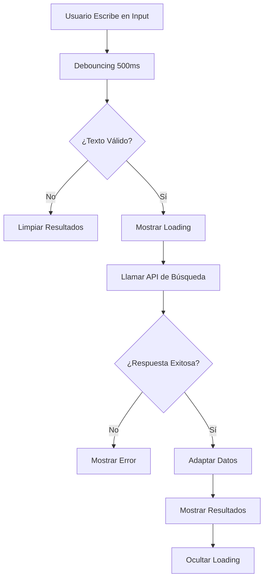
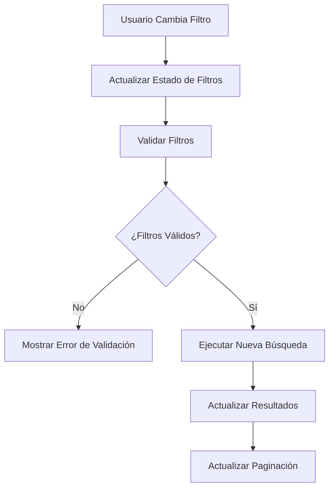
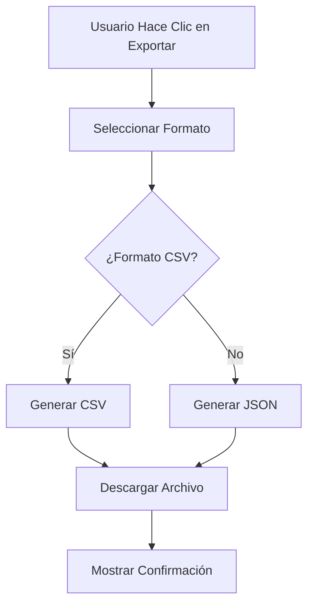

# 🔍 Búsqueda Avanzada - MussikOn Admin System

> **Sistema completo de búsqueda global con filtros múltiples y resultados adaptados del backend**

## 📋 Índice

1. [Descripción General](#descripción-general)
2. [Arquitectura del Sistema](#arquitectura-del-sistema)
3. [Funcionalidades Implementadas](#funcionalidades-implementadas)
4. [Componentes del Sistema](#componentes-del-sistema)
5. [Flujos de Trabajo](#flujos-de-trabajo)
6. [Configuración](#configuración)
7. [API Endpoints](#api-endpoints)
8. [Tipos de Búsqueda](#tipos-de-búsqueda)
9. [Filtros y Resultados](#filtros-y-resultados)
10. [Troubleshooting](#troubleshooting)

## 🎯 Descripción General

El Sistema de Búsqueda Avanzada de MussikOn Admin System es una solución completa de búsqueda global que permite encontrar eventos, usuarios y solicitudes en una sola interfaz. El sistema incluye filtros múltiples, resultados adaptados del backend, exportación de resultados y una interfaz responsive optimizada para todos los dispositivos.

### **Características Principales**
- ✅ **Búsqueda Global** - Eventos, usuarios, solicitudes en una sola interfaz
- ✅ **Filtros Múltiples** - Por categoría, estado, fecha, ubicación
- ✅ **Resultados Adaptados** - Conversión automática de respuestas del backend
- ✅ **Exportación** - Exportar resultados de búsqueda
- ✅ **Interfaz Responsive** - Optimizada para todos los dispositivos
- ✅ **Búsqueda en Tiempo Real** - Resultados instantáneos
- ✅ **Debouncing** - Optimización de rendimiento
- ✅ **Estados de Carga** - Indicadores visuales de progreso

## 🏗️ Arquitectura del Sistema

### **Componentes Principales**

```
Sistema de Búsqueda/
├── 📁 search/                      # Módulo principal de búsqueda
│   └── index.tsx                  # Componente principal
├── 📁 services/
│   └── searchService.ts           # Servicio de búsqueda
└── 📁 utils/
    └── searchDiagnostic.ts        # Utilidades de diagnóstico
```

### **Flujo de Datos**

```
Usuario Input → Debouncing → Search Service → Backend API → Data Adaptation → Results Display
```

## 🚀 Funcionalidades Implementadas

### **1. Búsqueda Global**
- **Búsqueda Unificada:** Eventos, usuarios y solicitudes en una sola interfaz
- **Resultados Combinados:** Visualización integrada de diferentes tipos de datos
- **Relevancia:** Ordenamiento por relevancia de resultados
- **Paginación:** Navegación por páginas de resultados

### **2. Filtros Avanzados**
- **Por Categoría:** Filtrar por tipo de contenido (eventos, usuarios, solicitudes)
- **Por Estado:** Filtrar por estado de eventos o solicitudes
- **Por Fecha:** Rango de fechas específico
- **Por Ubicación:** Filtros geográficos
- **Por Instrumento:** Para solicitudes de músicos
- **Por Rol:** Para usuarios

### **3. Resultados Adaptados**
- **Conversión Automática:** Adaptación de respuestas del backend al formato esperado
- **Estructura Unificada:** Formato consistente para todos los tipos de resultados
- **Metadatos Enriquecidos:** Información adicional para cada resultado
- **Iconos Diferenciados:** Identificación visual por tipo de contenido

### **4. Exportación de Resultados**
- **Formato CSV:** Datos tabulares para análisis
- **Formato JSON:** Datos estructurados para integración
- **Filtros Aplicados:** Exportación respeta filtros activos
- **Descarga Automática:** Descarga inmediata de archivos

### **5. Interfaz de Usuario**
- **Diseño Responsive:** Optimizado para móviles y desktop
- **Estados de Carga:** Indicadores visuales de progreso
- **Mensajes de Error:** Feedback claro en caso de errores
- **Accesibilidad:** Navegación por teclado y lectores de pantalla

## 📦 Componentes del Sistema

### **Search Component**
- **Input de Búsqueda:** Campo principal de búsqueda
- **Filtros:** Controles de filtrado avanzado
- **Resultados:** Lista de resultados de búsqueda
- **Paginación:** Navegación por páginas
- **Exportación:** Botones de exportación

### **Search Service**
- **Llamadas a API:** Comunicación con backend
- **Adaptación de Datos:** Conversión de respuestas
- **Manejo de Errores:** Gestión de errores de API
- **Caching:** Almacenamiento temporal de resultados

### **Search Utils**
- **Debouncing:** Optimización de búsquedas
- **Validación:** Verificación de parámetros
- **Formateo:** Preparación de datos para exportación
- **Diagnóstico:** Herramientas de debugging

## 🔄 Flujos de Trabajo

### **Flujo de Búsqueda Principal**



### **Flujo de Aplicación de Filtros**



### **Flujo de Exportación**



## ⚙️ Configuración

### **Variables de Entorno**

```env
# Backend URL para búsqueda
VITE_API_BASE_URL=http://192.168.100.101:3001

# Configuración de búsqueda
VITE_SEARCH_TIMEOUT=30000
VITE_SEARCH_DEBOUNCE=500
VITE_SEARCH_MAX_RESULTS=100
```

### **Configuración de API**

```typescript
// src/config/apiConfig.ts
export const API_CONFIG = {
  ENDPOINTS: {
    // Búsqueda
    SEARCH_GLOBAL: '/search/global',
    SEARCH_EVENTS: '/search/events',
    SEARCH_USERS: '/search/users',
    SEARCH_REQUESTS: '/search/musician-requests',
    SEARCH_LOCATION: '/search/location',
  }
};
```

## 🔌 API Endpoints

### **Endpoints de Búsqueda**

| Método | Endpoint | Descripción |
|--------|----------|-------------|
| GET | `/search/global` | Búsqueda global en todos los tipos |
| GET | `/search/events` | Búsqueda específica de eventos |
| GET | `/search/users` | Búsqueda específica de usuarios |
| GET | `/search/musician-requests` | Búsqueda específica de solicitudes |
| GET | `/search/location` | Búsqueda por ubicación |

### **Parámetros de Consulta**

| Parámetro | Tipo | Descripción |
|-----------|------|-------------|
| `q` | string | Query de búsqueda |
| `category` | string | Categoría (events, users, requests) |
| `status` | string | Estado de eventos o solicitudes |
| `dateFrom` | string | Fecha de inicio (YYYY-MM-DD) |
| `dateTo` | string | Fecha de fin (YYYY-MM-DD) |
| `location` | string | Ubicación geográfica |
| `instrument` | string | Instrumento musical |
| `role` | string | Rol de usuario |
| `limit` | number | Límite de resultados |
| `page` | number | Número de página |

## 🔍 Tipos de Búsqueda

### **Búsqueda Global**
- **Descripción:** Búsqueda en todos los tipos de contenido
- **Endpoint:** `/search/global`
- **Resultados:** Combinación de eventos, usuarios y solicitudes
- **Ordenamiento:** Por relevancia y fecha

### **Búsqueda de Eventos**
- **Descripción:** Búsqueda específica de eventos
- **Endpoint:** `/search/events`
- **Filtros:** Tipo, estado, fecha, ubicación
- **Resultados:** Lista de eventos que coinciden con la búsqueda

### **Búsqueda de Usuarios**
- **Descripción:** Búsqueda específica de usuarios
- **Endpoint:** `/search/users`
- **Filtros:** Rol, estado, ubicación
- **Resultados:** Lista de usuarios que coinciden con la búsqueda

### **Búsqueda de Solicitudes**
- **Descripción:** Búsqueda específica de solicitudes de músicos
- **Endpoint:** `/search/musician-requests`
- **Filtros:** Estado, instrumento, fecha, ubicación
- **Resultados:** Lista de solicitudes que coinciden con la búsqueda

### **Búsqueda por Ubicación**
- **Descripción:** Búsqueda basada en ubicación geográfica
- **Endpoint:** `/search/location`
- **Filtros:** Radio, coordenadas, ciudad
- **Resultados:** Contenido cercano a la ubicación especificada

## 📊 Filtros y Resultados

### **Filtros Disponibles**

#### **Filtros Generales**
- **Categoría:** `all`, `events`, `users`, `requests`
- **Límite:** Número máximo de resultados (1-100)
- **Página:** Número de página para paginación

#### **Filtros de Eventos**
- **Estado:** `scheduled`, `in-progress`, `completed`, `cancelled`
- **Tipo:** `concert`, `wedding`, `corporate`, `private`
- **Fecha:** Rango de fechas específico
- **Ubicación:** Ciudad o región

#### **Filtros de Usuarios**
- **Rol:** `admin`, `musician`, `organizer`, `user`
- **Estado:** `active`, `suspended`, `verified`
- **Ubicación:** Ciudad o región

#### **Filtros de Solicitudes**
- **Estado:** `pending`, `approved`, `rejected`, `in-review`
- **Instrumento:** `guitar`, `piano`, `drums`, `vocals`, etc.
- **Fecha:** Rango de fechas específico
- **Ubicación:** Ciudad o región

### **Estructura de Resultados**

#### **Resultado Unificado**
```typescript
interface SearchResult {
  id: string;
  type: 'event' | 'user' | 'request';
  title: string;
  description: string;
  relevance: number;
  metadata: {
    // Campos específicos según el tipo
    eventType?: string;
    date?: string;
    location?: string;
    status?: string;
    instrument?: string;
    role?: string;
  };
}
```

#### **Adaptación de Datos**
```typescript
// Función de adaptación para eventos
const adaptEventData = (event: any): SearchResult => ({
  id: event.id || event.user || 'event-' + Math.random(),
  type: 'event',
  title: event.eventName || 'Evento sin nombre',
  description: `${event.eventType || 'Evento'} - ${event.date || 'Sin fecha'}`,
  relevance: 1,
  metadata: {
    eventType: event.eventType,
    date: event.date,
    location: event.location,
    status: event.status
  }
});
```

## 🎭 Estados y Tipos

### **Estados de Búsqueda**

```typescript
type SearchStatus = 'idle' | 'loading' | 'success' | 'error';

interface SearchState {
  status: SearchStatus;
  query: string;
  results: SearchResult[];
  filters: SearchFilters;
  pagination: {
    page: number;
    limit: number;
    total: number;
  };
  error?: string;
}
```

### **Tipos de Filtros**

```typescript
interface SearchFilters {
  category: 'all' | 'events' | 'users' | 'requests';
  status?: string;
  dateFrom?: string;
  dateTo?: string;
  location?: string;
  instrument?: string;
  role?: string;
  limit: number;
  page: number;
}
```

### **Tipos de Resultados**

```typescript
type ResultType = 'event' | 'user' | 'request';

interface SearchResult {
  id: string;
  type: ResultType;
  title: string;
  description: string;
  relevance: number;
  metadata: Record<string, any>;
}
```

## 🔧 Troubleshooting

### **Problemas Comunes**

#### **Búsqueda No Funciona**
- **Causa:** Problemas de conectividad o API
- **Solución:** Verificar URL del backend y conectividad
- **Workaround:** Verificar logs de consola para errores específicos

#### **Resultados Vacíos**
- **Causa:** Query muy específico o filtros muy restrictivos
- **Solución:** Ampliar criterios de búsqueda o relajar filtros
- **Workaround:** Probar con términos de búsqueda más generales

#### **Exportación Fallida**
- **Causa:** Problemas de permisos o formato
- **Solución:** Verificar permisos y formato de exportación
- **Workaround:** Verificar que hay resultados para exportar

### **Logs de Debugging**

```typescript
// Logs importantes para debugging
console.log('🔍 Iniciando búsqueda:', query);
console.log('📡 Llamando API con filtros:', filters);
console.log('✅ Resultados recibidos:', results.length);
console.log('❌ Error en búsqueda:', error);
console.log('🔄 Adaptando datos del backend:', backendData);
```

### **Verificación de Estado**

```bash
# Verificar conectividad con backend
npm run check-backend

# Verificar build del proyecto
npm run build

# Verificar linting
npm run lint
```

## 📈 Métricas y Estadísticas

### **Métricas Disponibles**

#### **Dashboard de Búsqueda**
- **Total de Búsquedas:** Número total de búsquedas realizadas
- **Resultados Promedio:** Promedio de resultados por búsqueda
- **Tiempo de Respuesta:** Tiempo promedio de respuesta de la API
- **Tasa de Éxito:** Porcentaje de búsquedas exitosas

#### **Estadísticas por Tipo**
- **Búsquedas de Eventos:** Métricas específicas de eventos
- **Búsquedas de Usuarios:** Métricas específicas de usuarios
- **Búsquedas de Solicitudes:** Métricas específicas de solicitudes
- **Búsquedas Globales:** Métricas de búsquedas combinadas

### **Reportes Disponibles**

#### **Exportación de Resultados**
- **CSV:** Datos tabulares de resultados de búsqueda
- **JSON:** Datos estructurados para análisis
- **Filtros Aplicados:** Exportación respeta filtros activos

#### **Análisis de Búsquedas**
- **Términos Más Buscados:** Análisis de queries populares
- **Filtros Más Usados:** Análisis de filtros aplicados
- **Patrones de Búsqueda:** Análisis de comportamiento de usuarios

## 🎯 Próximos Pasos

### **Mejoras Planificadas**
1. **Búsqueda Semántica:** Búsqueda por significado, no solo palabras clave
2. **Autocompletado:** Sugerencias de búsqueda en tiempo real
3. **Búsqueda por Voz:** Integración de reconocimiento de voz
4. **Filtros Avanzados:** Filtros más complejos y personalizados
5. **Resultados Personalizados:** Basados en historial del usuario

### **Optimizaciones**
1. **Performance:** Caching de resultados frecuentes
2. **UX:** Mejoras en la interfaz de usuario
3. **Accesibilidad:** Mejoras para usuarios con discapacidades
4. **Escalabilidad:** Optimización para grandes volúmenes de datos

### **Nuevas Funcionalidades**
1. **Búsqueda por Imagen:** Búsqueda visual de contenido
2. **Búsqueda por Ubicación:** Integración con mapas
3. **Alertas de Búsqueda:** Notificaciones de nuevos resultados
4. **Historial de Búsquedas:** Guardado de búsquedas recientes
5. **Búsqueda Colaborativa:** Compartir búsquedas con otros usuarios

---

**🔍 Búsqueda Avanzada** - MussikOn Admin System  
**Versión:** 2.0.0  
**Estado:** Completamente implementado y funcional 