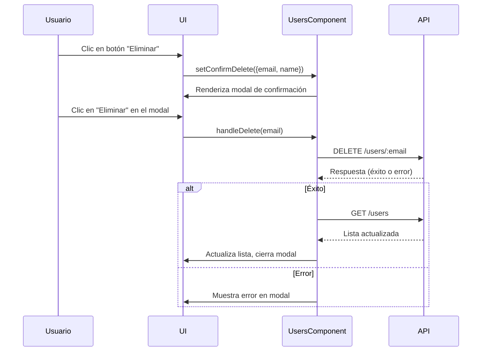

# Gestión de Usuarios

Este módulo implementa la gestión completa de usuarios (admin, organizadores, músicos) en el sistema. Permite listar, buscar, paginar, crear, editar, eliminar, cambiar roles y activar/desactivar usuarios. Utiliza formularios modales para alta/edición y validación de datos, y se integra con el backend para persistencia.

## Componente principal: `Users`

El componente `Users` es responsable de:
- Renderizar la tabla de usuarios registrados.
- Permitir búsqueda y paginación.
- Gestionar la creación, edición y eliminación de usuarios mediante formularios modales.
- Validar datos de entrada y mostrar errores.
- Integrarse con los servicios de backend para operaciones CRUD.

## Hooks y dependencias utilizadas
- `useState` y `useEffect` de React: para gestionar el estado local y efectos secundarios.
- **Hook global `useApiRequest`:** Abstrae la lógica de peticiones asíncronas (GET, POST, PUT, DELETE) y maneja estados de carga y error.
- Servicios de `usersService`: para interactuar con la API de usuarios.
- Estilos en `Users.css`.

## Flujo detallado de borrado de usuario

### 1. Inicio del borrado
- El usuario hace clic en el botón "Eliminar" de la tabla.
- Se ejecuta `setConfirmDelete({ email: u.userEmail, name: u.name + ' ' + u.lastName })`, lo que abre un modal de confirmación y guarda el usuario a eliminar.

### 2. Modal de confirmación
- Si `confirmDelete` tiene valor, se muestra un modal preguntando si realmente desea eliminar al usuario.
- El modal muestra el nombre y email del usuario y dos botones: "Cancelar" y "Eliminar".

### 3. Confirmación y ejecución del borrado
- Al hacer clic en "Eliminar" en el modal, se ejecuta `handleDelete(confirmDelete.email)`.
- **Función `handleDelete`:**
  1. Normaliza el email.
  2. Marca el usuario como objetivo de borrado (`setDeleteTarget`).
  3. Llama a `deleteUser` (hook `useApiRequest` con `deleteUserByEmail`), que hace la petición DELETE a la API.
  4. Si la petición es exitosa:
     - Refresca la lista de usuarios (`fetchUsers` y `setUsers`).
     - Cierra el modal (`setConfirmDelete(null)`).
  5. Si hay error, se muestra en el modal (`errorDelete`).
  6. Finalmente, limpia el estado de loading (`setDeleteTarget(null)`).

### 4. Estados y feedback visual
- Mientras se elimina el usuario, el botón muestra "Eliminando..." y está deshabilitado.
- Si ocurre un error, se muestra en rojo en el modal.
- Al terminar, se actualiza la UI según el resultado.

### Diagrama de secuencia del flujo de borrado



## Explicación línea por línea de `index.tsx`

```tsx
1  import { useEffect, useState } from 'react'; // Importa hooks de React para estado y efectos.
2  import type { User } from '../../services/usersService'; // Importa el tipo User.
3  import { getAllUsers, createUser, updateUser, deleteUserByEmail } from '../../services/usersService'; // Importa funciones CRUD del servicio.
4  import { useApiRequest } from '../../hooks/useApiRequest'; // Importa el hook para peticiones API.
5  import './Users.css'; // Importa los estilos del módulo.

6  const PAGE_SIZE = 10; // Define el tamaño de página para la paginación.
7  const ROLES = ['admin', 'organizador', 'musico']; // Define los roles posibles.

8  const initialForm: User = { name: '', lastName: '', userEmail: '', roll: 'musico', status: true, password: '' }; // Estado inicial del formulario.

9  const Users = () => { // Componente funcional principal.
10   const [users, setUsers] = useState<User[]>([]); // Estado para la lista de usuarios.
11   const [search, setSearch] = useState(''); // Estado para el filtro de búsqueda.
12   const [page, setPage] = useState(1); // Estado para la página actual.
13   const [modalOpen, setModalOpen] = useState(false); // Flag para mostrar/ocultar modal de formulario.
14   const [form, setForm] = useState<User>(initialForm); // Estado del formulario de usuario.
15   const [formError, setFormError] = useState(''); // Estado para errores del formulario.
16   const [editMode, setEditMode] = useState(false); // Flag para modo edición.
17   const [editUserEmail, setEditUserEmail] = useState<string | null>(null); // Email del usuario a editar.
18   const [confirmDelete, setConfirmDelete] = useState<{ email: string, name: string } | null>(null); // Estado para modal de confirmación de borrado.
19   const [deleteTarget, setDeleteTarget] = useState<string | null>(null); // Email del usuario en proceso de borrado.

20   // Hooks para peticiones
21   const {
22     loading: loadingUsers,
23     error: errorUsers,
24     execute: fetchUsers
25   } = useApiRequest(getAllUsers); // Hook para obtener usuarios.

26   const {
27     loading: loadingCreate,
28     error: errorCreate,
29     execute: createUserReq
30   } = useApiRequest(createUser); // Hook para crear usuario.

31   const {
32     loading: loadingUpdate,
33     error: errorUpdate,
34     execute: updateUserReq
35   } = useApiRequest(updateUser); // Hook para actualizar usuario.

36   const {
37     loading: loadingDelete,
38     error: errorDelete,
39     execute: deleteUser
40   } = useApiRequest(deleteUserByEmail); // Hook para eliminar usuario.

41   useEffect(() => {
42     fetchUsers().then(data => { if (data) setUsers(data); }); // Obtiene usuarios al montar el componente.
43   }, [fetchUsers]);

44   // Filtro de búsqueda
45   const filtered = users.filter(u =>
46     (u.name + ' ' + u.lastName + ' ' + u.userEmail).toLowerCase().includes(search.toLowerCase())
47   );
48   const totalPages = Math.ceil(filtered.length / PAGE_SIZE) || 1; // Calcula total de páginas.
49   const paginated = filtered.slice((page - 1) * PAGE_SIZE, page * PAGE_SIZE); // Usuarios de la página actual.

50   // Validación simple
51   const validate = () => {
52     if (!form.name.trim() || !form.lastName.trim() || !form.userEmail.trim()) return 'Completa todos los campos obligatorios.';
53     if (!/^[^@\s]+@[^@\s]+\.[^@\s]+$/.test(form.userEmail)) return 'Email inválido.';
54     if (!editMode && (!form.password?.trim() || form.password.length < 6)) return 'Contraseña mínima 6 caracteres.';
55     return '';
56   };

57   // Guardar usuario (crear o editar)
58   const handleSave = async () => {
59     setFormError('');
60     const err = validate();
61     if (err) { setFormError(err); return; }
62     try {
63       if (editMode && editUserEmail) {
64         await updateUserReq(editUserEmail, form);
65       } else {
66         await createUserReq(form);
67       }
68       setModalOpen(false);
69       setForm(initialForm);
70       setEditMode(false);
71       setEditUserEmail(null);
72       setPage(1);
73       // Refresca usuarios
74       const data = await fetchUsers();
75       if (data) setUsers(data);
76     } catch (e) {
77       setFormError(editMode ? 'Error al editar usuario' : 'Error al crear usuario');
78     }
79   };

80   // Eliminar usuario
81   const handleDelete = async (userEmail: string) => {
82     const normalizedEmail = userEmail.trim().toLowerCase();
83     setDeleteTarget(normalizedEmail);
84     try {
85       await deleteUser(normalizedEmail);
86       // Refresca usuarios
87       const data = await fetchUsers();
88       if (data) setUsers(data);
89       setConfirmDelete(null);
90     } catch (e) {
91       // El error se maneja por errorDelete
92     } finally {
93       setDeleteTarget(null);
94     }
95   };

96   return (
97     <div className="users-container glass-panel" style={{ boxShadow: '0 2px 8px #00fff711' }}>
98       <h2 style={{ marginBottom: 24 }}>Usuarios registrados</h2>
99       <div style={{ display: 'flex', justifyContent: 'space-between', alignItems: 'center', marginBottom: 18 }}>
100        <input
101          type="text"
102          placeholder="Buscar por nombre, email..."
103          value={search}
104          onChange={e => { setSearch(e.target.value); setPage(1); }}
105          style={{ width: 240, fontSize: 16, borderRadius: 8, border: '1.5px solid var(--color-primary)', background: 'var(--color-glass-strong)', color: '#fff', padding: '10px 14px', marginRight: 12 }}
106        />
107        <div style={{ display: 'flex', alignItems: 'center', gap: 12 }}>
108          <div style={{ color: '#b0b8c1', fontSize: 15 }}>
109            {filtered.length} usuario{filtered.length !== 1 ? 's' : ''} encontrados
110          </div>
111          <button className="btn" style={{ fontSize: 15, padding: '10px 18px', borderRadius: 8, boxShadow: '0 1px 4px #00fff711' }} onClick={() => { setModalOpen(true); setForm(initialForm); setFormError(''); setEditMode(false); setEditUserEmail(null); }}>+ Nuevo usuario</button>
112        </div>
113      </div>
114      {/* Modal sci-fi */}
115      {modalOpen && (
116        <div className="modal-overlay">
117          <div className="modal-glass" style={{ boxShadow: '0 4px 16px #00fff722' }}>
118            <h3 style={{ marginBottom: 18, color: 'var(--color-primary)' }}>{editMode ? 'Editar usuario' : 'Nuevo usuario'}</h3>
119            <div style={{ display: 'flex', flexDirection: 'column', gap: 14 }}>
120              <input type="text" placeholder="Nombre" value={form.name} onChange={e => setForm(f => ({ ...f, name: e.target.value }))} style={{ fontSize: 16 }} />
121              <input type="text" placeholder="Apellido" value={form.lastName} onChange={e => setForm(f => ({ ...f, lastName: e.target.value }))} style={{ fontSize: 16 }} />
122              <input type="email" placeholder="Email" value={form.userEmail} onChange={e => setForm(f => ({ ...f, userEmail: e.target.value }))} style={{ fontSize: 16 }} disabled={editMode} />
123              <select value={form.roll} onChange={e => setForm(f => ({ ...f, roll: e.target.value }))} style={{ fontSize: 16 }}>
124                {ROLES.map(r => <option key={r} value={r}>{r}</option>)}
125              </select>
126              <label style={{ color: '#b0b8c1', fontSize: 15 }}>
127                <input type="checkbox" checked={form.status} onChange={e => setForm(f => ({ ...f, status: e.target.checked }))} style={{ marginRight: 8 }} /> Activo
128              </label>
129              {!editMode && <input type="password" placeholder="Contraseña" value={form.password} onChange={e => setForm(f => ({ ...f, password: e.target.value }))} style={{ fontSize: 16 }} />}
130            </div>
131            {formError && <div style={{ color: '#ff5252', margin: '12px 0' }}>{formError}</div>}
132            <div style={{ display: 'flex', gap: 16, marginTop: 18, justifyContent: 'flex-end' }}>
133              <button className="btn" style={{ background: 'var(--color-gradient-3)', boxShadow: '0 1px 4px #00fff711' }} onClick={() => { setModalOpen(false); setEditMode(false); setEditUserEmail(null); }} disabled={loadingUpdate || loadingCreate}>Cancelar</button>
134              <button className="btn" style={{ background: 'var(--color-gradient-2)', boxShadow: '0 1px 4px #00fff711' }} onClick={handleSave} disabled={loadingUpdate || loadingCreate}>{loadingUpdate || loadingCreate ? 'Guardando...' : 'Guardar'}</button>
135            </div>
136          </div>
137        </div>
138      )}
139      {loadingUsers && <div style={{ color: '#00fff7', fontWeight: 600, margin: '24px 0' }}>Cargando usuarios...</div>}
140      {errorUsers && <div style={{ color: '#ff5252', margin: '24px 0' }}>{errorUsers}</div>}
141      {errorCreate && <div style={{ color: '#ff5252', margin: '18px 0' }}>{errorCreate}</div>}
142      {errorUpdate && <div style={{ color: '#ff5252', margin: '18px 0' }}>{errorUpdate}</div>}
143      {errorDelete && <div style={{ color: '#ff5252', margin: '18px 0' }}>{errorDelete}</div>}
144      {!loadingUsers && !errorUsers && (
145        <>
146          <div className="users-table-wrapper">
147            <table className="users-table">
148              <thead>
149                <tr>
150                  <th>Nombre</th>
151                  <th>Apellido</th>
152                  <th>Email</th>
153                  <th>Rol</th>
154                  <th>Estado</th>
155                  <th></th>
156                </tr>
157              </thead>
158              <tbody>
159                {paginated.length === 0 ? (
160                  <tr><td colSpan={6} style={{ textAlign: 'center', color: '#b0b8c1', fontSize: 17, padding: 32 }}>No hay usuarios para mostrar.</td></tr>
161                ) : paginated.map((u, i) => (
162                  <tr key={i}>
163                    <td>{u.name}</td>
164                    <td>{u.lastName}</td>
165                    <td>{u.userEmail}</td>
166                    <td>{u.roll}</td>
167                    <td>{u.status ? 'Activo' : 'Inactivo'}</td>
168                    <td>
169                      <div style={{ display: 'flex', gap: 12, justifyContent: 'center', alignItems: 'center' }}>
170                        <button className="btn" style={{ padding: '7px 18px', fontSize: 15, background: 'var(--color-gradient-1)', borderRadius: 8, minWidth: 90, boxShadow: '0 1px 4px #00fff711' }}
171                          onClick={() => {
172                            setModalOpen(true);
173                            setEditMode(true);
174                            setEditUserEmail(u.userEmail);
175                            setForm({ name: u.name, lastName: u.lastName, userEmail: u.userEmail, roll: u.roll, status: u.status, password: '' });
176                            setFormError('');
177                          }}
178                        >Editar</button>
179                        <button className="btn" style={{ padding: '7px 18px', fontSize: 15, background: 'var(--color-gradient-3)', borderRadius: 8, minWidth: 90, boxShadow: '0 1px 4px #00fff711' }}
180                          onClick={() => setConfirmDelete({ email: u.userEmail, name: u.name + ' ' + u.lastName })}
181                          disabled={deleteTarget === u.userEmail && loadingDelete}
182                        >{deleteTarget === u.userEmail && loadingDelete ? 'Eliminando...' : 'Eliminar'}</button>
183                      </div>
184                    </td>
185                  </tr>
186                ))}
187              </tbody>
188            </table>
189          </div>
190          {/* Paginación */}
191          {totalPages > 1 && (
192            <div style={{ display: 'flex', justifyContent: 'center', gap: 12, marginTop: 18 }}>
193              <button className="btn" style={{ padding: '6px 16px', fontSize: 15 }} onClick={() => setPage(p => Math.max(1, p - 1))} disabled={page === 1}>Anterior</button>
194              <span style={{ color: '#fff', fontWeight: 600, fontSize: 16 }}>Página {page} de {totalPages}</span>
195              <button className="btn" style={{ padding: '6px 16px', fontSize: 15 }} onClick={() => setPage(p => Math.min(totalPages, p + 1))} disabled={page === totalPages}>Siguiente</button>
196            </div>
197          )}
198        </>
199      )}
200      {/* Modal de confirmación de borrado */}
201      {confirmDelete && (
202        <div className="modal-overlay" style={{ animation: 'fadeInSciFi 0.25s' }}>
203          <div className="modal-glass sci-fi-modal-alert" style={{ boxShadow: '0 4px 24px #ff525244', minWidth: 340, maxWidth: 400, border: '2px solid var(--color-accent)', background: 'rgba(32,37,52,0.95)', position: 'relative', animation: 'scaleInSciFi 0.25s' }}>
204            <div style={{ display: 'flex', flexDirection: 'column', alignItems: 'center', marginBottom: 12 }}>
205              <span style={{ fontSize: 48, color: 'var(--color-accent)', textShadow: '0 0 16px #ff2eec99', marginBottom: 8 }}>⚠️</span>
206              <h3 style={{ color: 'var(--color-accent)', marginBottom: 10, textAlign: 'center', letterSpacing: 1 }}>¿Eliminar usuario?</h3>
207            </div>
208            <div style={{ color: '#fff', marginBottom: 18, fontSize: 18, textAlign: 'center', textShadow: '0 2px 8px #ff2eec33' }}>
209              ¿Seguro que deseas eliminar a <span style={{ color: 'var(--color-primary)', fontWeight: 700 }}>{confirmDelete.name}</span>?
210            </div>
211            {errorDelete && <div style={{ color: '#ff5252', marginBottom: 10, textAlign: 'center' }}>{errorDelete}</div>}
212            <div style={{ display: 'flex', gap: 18, justifyContent: 'center', marginTop: 8 }}>
213              <button className="btn" style={{ background: 'var(--color-gradient-1)', boxShadow: '0 1px 4px #00fff711', border: '2px solid #00fff7', color: '#fff', fontWeight: 600 }} onClick={() => setConfirmDelete(null)} disabled={deleteTarget === confirmDelete.email && loadingDelete}>Cancelar</button>
214              <button className="btn" style={{ background: 'var(--color-gradient-3)', boxShadow: '0 1px 4px #ff2eec33', border: '2px solid #ff2eec', color: '#fff', fontWeight: 600 }}
215                onClick={() => handleDelete(confirmDelete.email)}
216                disabled={deleteTarget === confirmDelete.email && loadingDelete}
217              >{deleteTarget === confirmDelete.email && loadingDelete ? 'Eliminando...' : 'Eliminar'}</button>
218            </div>
219          </div>
220        </div>
221      )}
222    </div>
223  );
224 };

225 export default Users; // Exporta el componente para su uso en el ruteo.
```

---

Consulta DOCUMENTACION.md en la raíz del proyecto para detalles de endpoints y prioridades. 